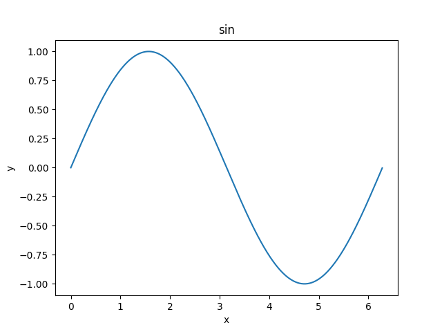
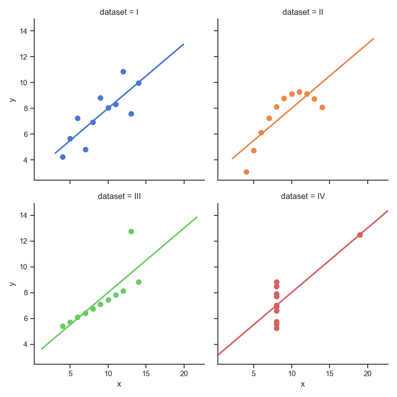
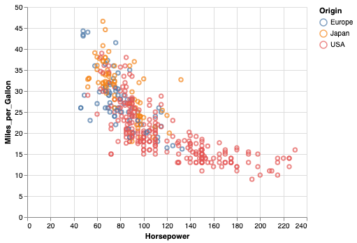

#+title: Numpy
#+AUTHOR: 顏永進
#+INCLUDE: ../pdf.org
#+PROPERTY: header-args :eval never-export
#+TAGS: AI, Python
#+EXCLUDE_TAGS: noexport
#+OPTIONS: num:3
#+OPTIONS: ^:nil
#+LATEX:\newpage
#+HTML_HEAD: <link rel="stylesheet" type="text/css" href="../css/muse.css" />

#+latex:\newpage
#+begin_export html

#+end_export

* Move org with images :noexport:
replace file-1.org with filename
replace ~/tmp/my-new-directory with new folder
#+begin_src shell -r -n :results output :exports both
find -E data -type f -iregex ".*($(cat file-1.org | grep -i ':id:' | perl -pe 's/^\s*:id:\s*(\w{2})([\w-]+)$/$1\\\/$2/i' | paste -s -d'|' -)).*" -exec rsync -R '{}' ~/temp/my-new-directory \;
#+end_src

* 簡介

- NumPy 是 Python 語言的一個擴充程式庫。支援高階大量的維度陣列與矩陣運算，此外也針對陣列運算提供大量的數學函式函式庫。
- Numpy主要用於資料處理上。Numpy 底層以 C 和 Fortran 語言實作，所以能快速操作多重維度的陣列。[fn:1]
- 當 Python 處理龐大資料時，其原生 list 效能表現並不理想（但可以動態存異質資料），而 Numpy 具備平行處理的能力，可以將操作動作一次套用在大型陣列上。
- Python 多數重量級的資料科學相關套件（例如：Pandas、SciPy、Scikit-learn 等）都幾乎是奠基在 Numpy 的基礎上。因此學會 Numpy 對於往後學習其他資料科學相關套件打好堅實的基礎。
- NumPy 的前身 Numeric 最早是由 Jim Hugunin 與其它協作者共同開發，2005 年，Travis Oliphant 在 Numeric 中結合了另一個同性質的程式庫 Numarray 的特色，並加入了其它擴充功能而開發了 NumPy。NumPy 為開放原始碼並且由許多協作者共同維護開發。[fn:3]
- 延伸閱讀: [[https://hsinchengchao.medium.com/%E7%82%BA%E4%BB%80%E9%BA%BC%E8%A6%81%E7%94%A8-numpy-c829e0049977][為什麼要用 Numpy？]]

* 安裝模組
#+begin_src shell -r -n :results output :exports both
pip install numpy
#+end_src
*** PyCharm
#+CAPTION: 標題
#+LABEL:fig:Labl
#+name: fig:Name
#+ATTR_LATEX: :width 300
#+ATTR_ORG: :width 300
#+ATTR_HTML: :width 500
[[file:images/NumPy/2023-02-13_10-26-12_2023-02-13_10-24-46.png]]
*** Colab
#+begin_src python -r -n :results output :exports both
!pip install numpy
#+end_src

* 匯入模組
- 使用模組裡的函式要加模組名稱
#+BEGIN_SRC python
import numpy
#+END_SRC
- 匯入 numpy 模組並使用 np 作為簡寫，這是 Numpy 官方倡導的寫法
#+BEGIN_SRC python
import numpy as np
#+END_SRC

* NumPy 陣列
** NDArray
- Numpy 中的多維資料型別稱為 ndarray
- Numpy 的重點在於陣列的操作，其所有功能特色都建築在同質且多重維度的 ndarray（N-dimensional array）上。
- ndarray 的關鍵屬性是維度（ndim）、形狀（shape）和數值類型（dtype）。 一般我們稱一維陣列為 vector 而二維陣列為 matrix[fn:4]。

** 建立ndarray
一開始我們會引入 numpy 模組，透過傳入 list 到 numpy.array() 創建陣列。
- axis 0, axis 1, axis 2:
  一維時 axis 0為x軸
  二維時 axis 0為y軸
- [[https://numpy.org/doc/stable/reference/routines.array-creation.html#][NumPy官網]]
- Numpy 的重點在於陣列的操作，其所有功能特色都建築在同質且多重維度的 ndarray（N-dimensional array）上。
- ndarray 的關鍵屬性是維度（ndim）、形狀（shape）和數值類型（dtype）。 一般我們稱一維陣列為 vector 而二維陣列為 matrix[fn:4]。
- axis 0, axis 1, axis 2:
  一維時 axis 0為x軸
  二維時 axis 0為y軸
*** 一維陣列
**** 可以將python的list 或 tuple 轉成NumPy Array
#+BEGIN_SRC python :results output :exports both :wrap
import numpy as np
np1 = np.array( [1, 2, 3, 4] )
print(np1)
#+END_SRC

#+RESULTS:
: [1 2 3 4]
**** 使用 np.arange( ) 方法
#+BEGIN_SRC python :results output :exports both
import numpy as np

np2 = np.arange(5)
print("=====np2=====")
print(np2)
np3 = np.arange(1, 4, 0.5)
print("=====np3=====")
print(np3)
#+END_SRC

  #+RESULTS:
  : =====np2=====
  : [0 1 2 3 4]
  : =====np3=====
  : [1.  1.5 2.  2.5 3.  3.5]
**** np.arange() v.s. range()
差異：
+ range()為 python 內建函數
+ range() return 的是 range object，而 np.nrange() return 的是 numpy.ndarray()
+ range()不支援 step 為小數，np.arange()支援 step 為小數
**** 簡單的矩陣運算
#+begin_src python -r -n :results output :exports both
import numpy as np
np1 = np.array([1, 2, 3])
np2 = np.array([3, 4, 5])
# 陣列相加
print(np1 + np2) # [4 6 8]
# 顯示相關資訊
print(np1.ndim, np1.shape, np1.dtype) # 1 (3,) int64 => 一維陣列, 三個元素, 資料型別
#+end_src

#+RESULTS:
: [4 6 8]
: 1 (3,) int64

*** 二維陣列
  #+BEGIN_SRC python :results output :exports both
import numpy as np

np4 = np.array( [[1, 2, 4], [3, 4, 5]] )
print("shape:", np4.shape)
print("np4:\n", np4)
print("取出第0列:",np4[0])
print("取出第1行:",np4[:,1])
np5 = np.array([np.arange(3), np.arange(3)])
print('np5:\n', np5)

np6 = np.arange(8).reshape(2, 4)
print('np6:\n', np6)
  #+END_SRC

  #+RESULTS:
  #+begin_example
  shape: (2, 3)
  np4:
   [[1 2 4]
   [3 4 5]]
  取出第0列: [1 2 4]
  取出第1行: [2 4]
  np5:
   [[0 1 2]
   [0 1 2]]
  np6:
   [[0 1 2 3]
   [4 5 6 7]]
  #+end_example
*** 多維陣列
  #+BEGIN_SRC python :results output :exports both
import numpy as np

np7 = np.arange(24).reshape(2, 3, 4)
print('np7:\n',np7)

np8 = np.arange(13, 60, 2).reshape(2, 3, 4)
print("np8:\n", np8)
  #+END_SRC

  #+RESULTS:
  #+begin_example
  np7:
   [[[ 0  1  2  3]
    [ 4  5  6  7]
    [ 8  9 10 11]]

   [[12 13 14 15]
    [16 17 18 19]
    [20 21 22 23]]]
  np8:
   [[[13 15 17 19]
    [21 23 25 27]
    [29 31 33 35]]

   [[37 39 41 43]
    [45 47 49 51]
    [53 55 57 59]]]
  #+end_example
*** 隨機矩陣
**** numpy.random.randint()
語法：numpy.random.randint(low, high=None, size=None, dtype='l')

函式的作用是，返回一個隨機整型數，範圍從低（包括）到高（不包括），即[low, high)。
如果沒有寫引數 high 的值，則返回[0,low)的值。
#+BEGIN_SRC python -r -n :results output :exports both
  import numpy as np
  np.random.seed(0)

  x1 = np.random.randint(10, size=6)
  x2 = np.random.randint(10, size=(3,4))
  x3 = np.random.randint(10, size=(3,4,5))
  print(x1)
  print(x2)
  print(x3)
#+END_SRC

#+RESULTS:
#+begin_example
[5 0 3 3 7 9]
[[3 5 2 4]
 [7 6 8 8]
 [1 6 7 7]]
[[[8 1 5 9 8]
  [9 4 3 0 3]
  [5 0 2 3 8]
  [1 3 3 3 7]]

 [[0 1 9 9 0]
  [4 7 3 2 7]
  [2 0 0 4 5]
  [5 6 8 4 1]]

 [[4 9 8 1 1]
  [7 9 9 3 6]
  [7 2 0 3 5]
  [9 4 4 6 4]]]
#+end_example
**** numpy.random.rand()
根據給定維度生成(0,1)間的資料，包含 0，不包含 1
#+BEGIN_SRC python -r -n :results output :exports both
  import numpy as np

  np.random.seed(9627) #設置相同變數，每次生成相同亂數
  ar = np.random.rand(2,4)
  print(ar)
#+END_SRC

#+RESULTS:
: [[0.28012059 0.19216219 0.63985614 0.48842053]
:  [0.9441813  0.88992099 0.17534833 0.29543319]]
**** 範例
#+BEGIN_SRC python :results output :exports both
import numpy as np

np8 = np.random.random((3, 2)) #矩陣大小以tuple表示
print('np8:\n', np8)
# 四個人擲骰子，每人擲兩次
np9 = np.random.randint(1, 7, size=[4, 2]) #矩陣大小以list表示
print('np9:\n', np9)
#+END_SRC

  #+RESULTS:
  : np8:
  :  [[0.7263954  0.71063088]
  :  [0.07725825 0.11562424]
  :  [0.57923875 0.85345365]]
  : np9:
  :  [[5 6]
  :  [2 2]
  :  [5 5]
  :  [5 2]]
*** 0/1 矩陣
- np.zeros: np.zeros( (陣列各維度大小用逗號區分) )：建立全為 0 的陣列，可以小括號定義陣列的各個維度的大小
#+BEGIN_SRC python :results output :exports both
import numpy as np

zeros = np.zeros( (3, 5) )
print("zeros=>\n{0}".format(zeros))
#+END_SRC

#+RESULTS:
: zeros=>
: [[0. 0. 0. 0. 0.]
:  [0. 0. 0. 0. 0.]
:  [0. 0. 0. 0. 0.]]

- np.ones: np.ones( (陣列各維度大小用逗號區分) )：用法與 np.zeros 一樣
#+BEGIN_SRC python :results output :exports both
import numpy as np

ones = np.ones( (4, 3) )
print("oness=>\n{0}".format(ones))
#+END_SRC

#+RESULTS:
: oness=>
: [[1. 1. 1.]
:  [1. 1. 1.]
:  [1. 1. 1.]
:  [1. 1. 1.]]
*** TODO 型態轉換
:PROPERTIES:
:ID:       e75aeac7-75d1-497c-8dd6-fb997d77cd08
:END:
astype
*** TODO 補入教材
:PROPERTIES:
:ID:       3ed339f8-6d24-4ddb-bbf8-4faba8910e25
:END:
[[https://github.com/letranger/AI4H2022/blob/main/week1_%E8%B3%87%E6%96%99%E7%A7%91%E5%AD%B81/1_1_numpy.md][numpy 學習主題]]
*** tmp
#+BEGIN_SRC python -r -n :results output :exports both
# 引入 numpy 模組
import numpy as np
# create identity matrix
ary1 = np.eye(3)
print(ary1)
# create diagonal array
ary2 = np.diag((2,1,4,6))
print(ary2)
#
ary3 = np.array([range(i, i+3) for i in [2,4,6]])
print(ary3)
# tile
ary4 = np.array([0,1,2])
print(np.tile(ary4,2))
print(np.tile(ary4,(2,2)))
ary5 = np.array([[1,2],[6,7]])
print(np.tile(ary5,3))
print(np.tile(ary5,(2,2)))
#+END_SRC

#+RESULTS:
#+begin_example
[[1. 0. 0.]
 [0. 1. 0.]
 [0. 0. 1.]]
[[2 0 0 0]
 [0 1 0 0]
 [0 0 4 0]
 [0 0 0 6]]
[[2 3 4]
 [4 5 6]
 [6 7 8]]
[0 1 2 0 1 2]
[[0 1 2 0 1 2]
 [0 1 2 0 1 2]]
[[1 2 1 2 1 2]
 [6 7 6 7 6 7]]
[[1 2 1 2]
 [6 7 6 7]
 [1 2 1 2]
 [6 7 6 7]]
#+end_example

* 矩陣運算
** Numpy計算時間比較
#+begin_src emacs-lisp
(setq org-babel-python-command "ipython --no-banner --classic --no-confirm-exit")
#+end_src
自行比較以下兩個版本的執行時間
#+begin_src python  :results output :exports both
ar = np.arange(1000)
%timeit ar**3
#+end_src
#+begin_src python -r -n :results output :exports both
%timeit [i**3 for i in range(1000)]
#+end_src

#+begin_src python  :results output :exports both
import numpy as np
ar = np.arange(1000)
%timeit ar**3
#+end_src
** [課堂練習]
- 模擬一個37人/7科的全班月考成績(隨機生成)
  #+begin_src python -r :results output :exports both
1 : 33	66	29
2 : 86	1	11
3 : 84	66	81
4 : 76	38	16
5 : 13	27	77
6 : 88	14	47
7 : 45	70	35
8 : 94	79	98
  #+end_src
** 矩陣運算
*** 矩陣變形:reshape()
1. reshape()
2. transpose()
**** reshape
#+BEGIN_SRC python -r -n :results output :exports both
import numpy as np
x = np.arange(2,10)
print(x.reshape(2,4))
#+END_SRC

#+RESULTS:
: [[2 3 4 5]
:  [6 7 8 9]]
**** Flattening and Transpose
#+BEGIN_SRC python -r -n :results output :exports both
import numpy as np
ac = np.array([np.arange(1,6),np.arange(10,15)])
print(ac)
print(ac.ravel())
print(ac.T)
#+END_SRC

#+RESULTS:
: [[ 1  2  3  4  5]
:  [10 11 12 13 14]]
: [ 1  2  3  4  5 10 11 12 13 14]
: [[ 1 10]
:  [ 2 11]
:  [ 3 12]
:  [ 4 13]
:  [ 5 14]]
**** Add a dimension
#+BEGIN_SRC python -r -n :results output :exports both
  import numpy as np
  ar = np.array([14,15,16])
  print(ar)
  print(ar.shape)

  ar = ar[:,np.newaxis]
  print(ar.shape)
  print(ar)
#+END_SRC

#+RESULTS:
: [14 15 16]
: (3,)
: (3, 1)
: [[14]
:  [15]
:  [16]]
*** 索引(Indexing)、切片(Slicing)
索引(Indexing)的用途不外乎就是為了要從陣列和矩陣中取值，但除此之外有很多種功能！可以取出連續區間，還可以間隔取值！[fn:5]
**** 選取連續區間 [a:b]
#+begin_src python -r -n :results output :exports both
import numpy as np
a = np.arange(10) ** 2
print("a=> {0}".format(a))
print("a[2:5]=> {0}".format(a[2:5]))
#+end_src

#+RESULTS:
: a=> [ 0  1  4  9 16 25 36 49 64 81]
: a[2:5]=> [ 4  9 16]
**** 間隔選取[::c]
以1維陣列來說明x[a:b:c]
- a：選取資料的起始索引
- b：選取資料的結束索引+1
- c：選取資料間隔，以索引值可以被此值整除的元素，不指定表示1
#+begin_src python -r -n :results output :exports both
import numpy as np
a = np.arange(10) ** 2
print("a==> {0}".format(a))
a[2:9:3] = 999
print("a==> {0}".format(a))
#+end_src

#+RESULTS:
: a==> [ 0  1  4  9 16 25 36 49 64 81]
: a==> [  0   1 999   9  16 999  36  49 999  81]
*** 取出特定行列、特定範圍
- 取出第x列: Ary[x]
- 取出第x行: Ary[:,x]
- 取出第x_{1}~x_{2}列、第y_{1}~y_{2}行的範圍: Ary[x_{1}:x_{2} + 1, y_{1}:y_{2} + 1]
#+begin_src python -r -n :results output :exports both
import numpy as np
a = np.arange(12).reshape(3, 4)
print(a)
print(a[1])
print(a[:,1])
print(a[1:3, 1:3])
#+end_src

#+RESULTS:
: [[ 0  1  2  3]
:  [ 4  5  6  7]
:  [ 8  9 10 11]]
: [4 5 6 7]
: [1 5 9]
: [[ 5  6]
:  [ 9 10]]
*** 刪除行/列
np.delete(temp,0,axis=1)#temp為操作物件，0表示要刪除的物件索引，axis表示行還是列，axis=0表示刪除行，axis=1表示刪除列。
#+begin_src python -r -n :results output :exports both
import numpy as np

a = np.arange(12).reshape(3, 4)
print(a)
a_delCol1 = np.delete(a, 1, 0)
print('刪除第1行')
print(a_delCol1)
a_delRow1 = np.delete(a, 1, 1)
print('刪除第1列')
print(a_delRow1)
print('現在的a')
print(a)
#+end_src

#+RESULTS:
#+begin_example
[[ 0  1  2  3]
 [ 4  5  6  7]
 [ 8  9 10 11]]
刪除第1行
[[ 0  1  2  3]
 [ 8  9 10 11]]
刪除第1列
[[ 0  2  3]
 [ 4  6  7]
 [ 8 10 11]]
現在的a
[[ 0  1  2  3]
 [ 4  5  6  7]
 [ 8  9 10 11]]
#+end_example
*** 迭代(輸出)
如果是要對整個矩陣的值做運算，無需使用迴圈
**** 一維陣列
#+begin_src python -r -n :results output :exports both
import numpy as np
a = np.arange(4) ** 2
print("a: ",a)
for i in a:
    print("a**(1/2)=> {0}".format(np.round(i**(1/2), 0)))
#+end_src

#+RESULTS:
: ('a: ', array([0, 1, 4, 9]))
: a**(1/2)=> 1
: a**(1/2)=> 1
: a**(1/2)=> 1
: a**(1/2)=> 1
**** 多維陣列: 多維陣列在for loop中取值時，會以第一維度為優先！
  #+begin_src python -r -n :results output :exports both
import numpy as np
a = np.arange(1, 41).reshape(5, 8)
for row in a:
    for i in row:
        print("{0:3d}".format(i), end='')
    print()

  #+end_src

  #+RESULTS:
  :   1  2  3  4  5  6  7  8
  :   9 10 11 12 13 14 15 16
  :  17 18 19 20 21 22 23 24
  :  25 26 27 28 29 30 31 32
  :  33 34 35 36 37 38 39 40
*** 基礎運算
**** 維度相同的矩陣相加、減
#+BEGIN_SRC python :results output :exports both
import numpy as np
a = np.array( [6, 7, 8, 9] )
b = np.arange( 4 )
c = a - b
print("a=>{0}".format(a))
print("b=>{0}".format(b))
print("c=>{0}".format(c))
#+END_SRC
  #+RESULTS:
  : a=>[6 7 8 9]
  : b=>[0 1 2 3]
  : c=>[6 6 6 6]
**** 矩陣與常數運算
#+BEGIN_SRC python :results output :exports both
import numpy as np
import math
a = np.random.randint(100, size=(2, 4)) #矩陣大小以tuple表示

b = a + 10
c = a**2
print("a=>{0}".format(a))
print("b=>{0}".format(b))
print("c=>{0}".format(c))
#+END_SRC

#+RESULTS:
: a=>[[51 74 98 37]
:  [13 13 74 86]]
: b=>[[ 61  84 108  47]
:  [ 23  23  84  96]]
: c=>[[2601 5476 9604 1369]
:  [ 169  169 5476 7396]]
*** 矩陣轉置
$$a=\begin{bmatrix}1&0\\2&3\end{bmatrix}, a^T=\begin{bmatrix}1&2\\0&3\end{bmatrix}$$
#+begin_src python :results output :exports both
import numpy as np
a = np.array([[1, 0],
              [2, 3]])
print(a)
print('--Matrix transpose--')
print(a.transpose())
#+end_src

#+RESULTS:
: [[1 0]
:  [2 3]]
: --Matrix transpose--
: [[1 2]
:  [0 3]]
*** 矩陣相乘
**** 矩陣乘法
  $$a=\begin{bmatrix}a_{11}&a_{12}\\a_{21}&a_{22}\end{bmatrix}, b=\begin{bmatrix}b_{11}&b_{12}&b_{13}\\b_{21}&b_{22}&b_{23}\end{bmatrix}$$
  $$a \cdot b=\begin{bmatrix}a_{11}*b_{11}+a_{12}*b_{21}&a_{11}*b_{12}+a_{12}*b_{22}&a_{11}*b_{13}+a_{12}*b_{23}\\a_{21}*b_{11}+a_{22}*b_{21}&a_{21}*b_{12}+a_{22}*b_{22}&a_{21}*b_{13}+a_{22}*b_{23}\end{bmatrix}$$
#+begin_src python :results output :exports both
import numpy as np
A = np.array([[1, 2, 3], [4, 3, 2]])
B = np.array([[1, 2], [2, 0], [3, -1]])
print("{0}".format(A.dot(B)))
#+end_src

#+RESULTS:
: [[14 -1]
:  [16  6]]
**** 相對位置乘法
  $$a=\begin{bmatrix}a_{11}&a_{12}\\a_{21}&a_{22}\end{bmatrix}, b=\begin{bmatrix}b_{11}&b_{12}\\b_{21}&b_{22}\end{bmatrix}$$
  $$a \cdot b=\begin{bmatrix}a_{11}*b_{11}&a_{12}*b_{12}\\a_{21}*b_{21}&a_{22}*b_{22}\end{bmatrix}$$
#+begin_src python :results output :exports both
import numpy as np
A = np.array([[1, 2], [4, 5]])
B = np.array([[7, 8], [9, 10]])
print("A:\n{0}".format(A))
print("B:\n{0}".format(B))
print("A*B:\n{0}".format(A*B))

#+end_src

#+RESULTS:
: A:
: [[1 2]
:  [4 5]]
: B:
: [[ 7  8]
:  [ 9 10]]
: A*B:
: [[ 7 16]
:  [36 50]]
**** 取代矩陣中元素
這裡也可以看出NumPy對於選取矩陣中元素的極好彈性，可直接以條件來當成選取方式
#+begin_src python :results output :exports both
import numpy as np

C = np.array([5, -1, 3, 9, 0])
print(C<=0)
# 將矩陣中小於等於0的元素取代為0;其他轉為1
C[C<=0] = 0
C[C>0] = 1
print(C)
#+end_src

#+RESULTS:
: [False  True False False  True]
: [1 0 1 1 0]
**** [課堂練習]
- 模擬一個37人/7科的全班月考成績(隨機生成, 0~100)
- 將所有 55<=分數<60 的成績均改為60
*** 矩陣間元素相乘
#+BEGIN_SRC python -r -n :results output :exports both
import numpy as np
ar = np.arange(1,5)
print(ar.prod())

ar1 = np.array([np.arange(1,4),np.arange(4,7),np.arange(7,10)])
print(ar1)
print(np.prod(ar1, axis=1))
print(ar1.sum())
print(ar1.mean())
print(np.median(ar1))
#+END_SRC

#+RESULTS:
: 24
: [[1 2 3]
:  [4 5 6]
:  [7 8 9]]
: [  6 120 504]
: 45
: 5.0
: 5.0

*** 反矩陣
AB=BA=I, 其中 I 為單位矩陣
#+begin_src python :results output :exports both
import numpy as np

A = np.array([[4, -7], [2, -3]])
print("A:\n", A)
B = np.linalg.inv(A)
print("B:\n", B)
print("A dot B:\n", A.dot(B))
#+end_src

#+RESULTS:
: A:
:  [[ 4 -7]
:  [ 2 -3]]
: B:
:  [[-1.5  3.5]
:  [-1.   2. ]]
: A dot B:
:  [[1. 0.]
:  [0. 1.]]
*** 合併矩陣
**** vstack
#+begin_src python :results output :exports both
import numpy as np
a = np.ones((2, 2))
b = np.zeros(2)
print(a)
print(b)
c = np.vstack((a, b))
print(c)
#+end_src

#+RESULTS:
: [[1. 1.]
:  [1. 1.]]
: [0. 0.]
: [[1. 1.]
:  [1. 1.]
:  [0. 0.]]
**** hstack
#+begin_src python :results output :exports both
import numpy as np
a = np.ones((2, 2))
b = [[3],
     [4]]
print(a)
print(b)
c = np.hstack((a, b))
print(c)

#+end_src

#+RESULTS:
: [[1. 1.]
:  [1. 1.]]
: [[3], [4]]
: [[1. 1. 3.]
:  [1. 1. 4.]]
** 矩陣函數
*** [[https://numpy.org/doc/stable/reference/generated/numpy.sum.html][官網]]
*** numpy.sum()
**** 語法
#+begin_src python :eval no
numpy.sum(a, axis=None, dtype=None, out=None, keepdims=<no value>, initial=<no value>, where=<no value>)
#+end_src
其他參數用法詳見[[https://numpy.org/doc/stable/reference/generated/numpy.sum.html][官方網站]]
**** 範例
#+begin_src python :results output :exports both
import numpy as np

np_array_2x3 = np.array([[0,2,4],[1,3,5]])
print('=====Array=====')
print(np_array_2x3)
print('=====列=====')
print(np.sum(np_array_2x3, axis = 0))
print('=====行=====')
print(np.sum(np_array_2x3, axis = 1))
print('=====陣列總和1=====')
print(np.sum(np_array_2x3))
print('=====陣列總和2=====')
print(np_array_2x3.sum())

#+end_src

#+RESULTS:
#+begin_example
=====Array=====
[[0 2 4]
 [1 3 5]]
=====列=====
[1 5 9]
=====行=====
[6 9]
=====陣列=====
15
=====陣列=====
15
#+end_example
*** 其他常用函數
- min()
- max()
- argmin
- mean()
- std()
- var()
- sqrt()
- size()
- dtype()
- itemsize()
#+begin_src python :results output :exports both
import numpy as np

np1 = np.random.randint(0, 10, size=[3, 2])
print("np\n", np1)
print("np1.sum", np1.sum())
print("sum:", sum(np1))
print("sum:", sum(np1,3))
print("min:", np1.min())
print("max:", np1.max())
print("mean:", np.mean(np1))
#+end_src

#+RESULTS:
#+begin_example
np
 [[0 0]
 [0 3]
 [0 3]]
np1.sum 6
sum: [0 6]
sum: [3 9]
min: 0
max: 3
mean: 1.0
#+end_example
*** sum() v.s. np.sum()
#+CAPTION: sum() v.s. np.sum()
#+LABEL: fig:SimpleSin2
#+name: fig:SimpleSin
#+ATTR_LATEX: :width 400
#+ATTR_HTML: :width 400
#+ATTR_ORG: :width 400
[[file:images/2sum.png]]
*** numpy.max()
**** 語法
#+begin_src python :results output :exports both
numpy.max(a, axis=None, out=None, keepdims=False)
#+end_src
- 求序列的最值
- 最少接收一個引數
- axis：預設為列向（也即 axis=0），axis = 1 時為行方向的最值；
**** 範例
#+begin_src python :results output :exports both
import numpy as np

np_array_2x3 = np.array([[9,2,8],[4,7,5]])
print('=====Array=====')
print(np_array_2x3)
print('=====列=====')
print(np.max(np_array_2x3, axis = 0))
print('=====行=====')
print(np.max(np_array_2x3, axis = 1))
print('=====陣列=====')
print(np.max(np_array_2x3))
#+end_src

#+RESULTS:
: =====Array=====
: [[9 2 8]
:  [4 7 5]]
: =====列=====
: [9 7 8]
: =====行=====
: [9 7]
: =====陣列=====
: 9
*** numpy.maxium()
**** 語法
#+begin_src python :results output :exports both
numpy.maximum：(X, Y, out=None)
#+end_src
- X 與 Y 逐位比較取其大者；
- 最少接收兩個引數
**** 範例
#+begin_src python :results output :exports both
import numpy as np
npA1 = np.array([[9,-9,8],[4,7,5]])
npA2 = np.array([[0,1,8],[10,-7,5]])
print("=====npA1=====")
print(npA1)
print("=====npA2=====")
print(npA2)
print("=====maximum=====")
print(np.maximum(npA1, npA2))
#+end_src

#+RESULTS:
: =====npA1=====
: [[ 9 -9  8]
:  [ 4  7  5]]
: =====npA2=====
: [[ 0  1  8]
:  [10 -7  5]]
: =====maximum=====
: [[ 9  1  8]
:  [10  7  5]]
*** numpy.argmax()
**** 語法
#+begin_src python :results output :exports both
numpy.argmax(a, axis=None, out=None)[source]¶
#+end_src
- a: 可以轉換為陣列的陣列或物件，我們需要在其中找到最高值的索引。
- axis: 沿著行(axis=0)或列(axis=1)查詢最大值的索引。預設情況下，通過對陣列進行展平可以找到最大值的索引。
- out: np.argmax 方法結果的佔位符。它必須有適當的大小以容納結果。Returns the indices of the maximum values along an axis.
**** 範例
***** 一維陣列
#+begin_src python :results output :exports both
import numpy as np

a=np.array([2,6,1,6])

print("Array:")
print(a)

req_index=np.argmax(a)
print("\nIndex with the largest value:")
print(req_index)

print("\nThe largest value in the array:")
print(a[req_index])
#+end_src

#+RESULTS:
: Array:
: [2 6 1 6]
:
: Index with the largest value:
: 1
:
: The largest value in the array:
: 6

***** 二維陣列
#+begin_src python :results output :exports both
import numpy as np

a = np.array([[2,1,6],
            [7,14,5]])

print("Array:")
print(a)

req_index=np.argmax(a, axis=0)
print("\nIndex with the largest value(axis=0):")
print(req_index)
req_index=np.argmax(a, axis=1)
print("\nIndex with the largest value(axis=1):")
print(req_index)
req_index=np.argmax(a)
print("\nIndex with the largest value:")
print(req_index)

#+end_src

#+RESULTS:
#+begin_example
Array:
[[ 2  1  6]
 [ 7 14  5]]

Index with the largest value(axis=0):
[1 1 0]

Index with the largest value(axis=1):
[2 1]

Index with the largest value:
4
#+end_example
#+CAPTION: Sequence of Arg in array
#+LABEL: fig:argSeq
#+name: fig:argSeq
#+ATTR_LATEX: :width 200
#+ATTR_HTML: :width 200
#+ATTR_ORG: :width 200
[[file:images/argSeq.jpg]]
*** about axis
#+CAPTION: Axis in ndarray
#+LABEL: fig:ndaryAix
#+name: fig:ndaryAix
#+ATTR_LATEX: :width 300
#+ATTR_HTML: :width 400
#+ATTR_ORG: :width 300
[[file:images/aryaxis.jpg]]
*** tile()
numpy.tile()是個什麼函數呢，說白了，就是把數組沿各個方向複製
#+begin_src python :results output :exports both
import numpy as np
print('=====一維tile=====')
b = np.array([[1, 2], [3, 4]])
b1 = np.tile(b, 2)
print(b1)
print('=====二維tile=====')
b2 = np.tile(b, (2, 3))
print(b2)
#+end_src

#+RESULTS:
: =====一維tile=====
: [[1 2 1 2]
:  [3 4 3 4]]
: =====二維tile=====
: [[1 2 1 2 1 2]
:  [3 4 3 4 3 4]
:  [1 2 1 2 1 2]
:  [3 4 3 4 3 4]]
*** numpy.allclose
- Returns True if two arrays are element-wise equal within a tolerance.
- The tolerance values are positive, typically very small numbers. The relative difference (rtol * abs(b)) and the absolute difference atol are added together to compare against the absolute difference between a and b.
- NaNs are treated as equal if they are in the same place and if equal_nan=True. Infs are treated as equal if they are in the same place and of the same sign in both arrays.
**** 語法
#+begin_src python :results output :exports both
numpy.allclose(a, b, rtol=1e-05, atol=1e-08, equal_nan=False)
#+end_src
**** Parameters
- a, b: array_like. Input arrays to compare.
- rtol: float. The relative tolerance parameter (see Notes).
- atol: float. The absolute tolerance parameter (see Notes).
- equal_nan: bool. Whether to compare NaN’s as equal. If True, NaN’s in a will be considered equal to NaN’s in b in the output array.
**** Returns
- allclose: bool. Returns True if the two arrays are equal within the given tolerance; False otherwise.
**** See also:
- [[https://numpy.org/doc/stable/reference/generated/numpy.isclose.html#numpy.isclose][isclose]]
- [[https://numpy.org/doc/stable/reference/generated/numpy.all.html#numpy.all][all]]
- [[https://numpy.org/doc/stable/reference/generated/numpy.all.html#numpy.all][any]]
- [[https://numpy.org/doc/stable/reference/generated/numpy.equal.html#numpy.equal][equal]]
**** DEMO
參考: [[https://www.itdaan.com/tw/cc576c8f8162ab7ee9e3d6afdbf454fc][測試兩個numpy數組(接近)是否相等，包括形狀]]
#+begin_src python :results output :exports both
import numpy as np
import math

print(math.pi)
x = np.array([[3.14159265, -0.1], [-0.1, 0.1]])
y = np.array([[math.pi, -0.1], [-0.1, 0.1]])

z1 = np.array([[[3.14159265, -0.1], [-0.1, 0.1]],
              [[3.14159265, -0.1], [-0.1, 0.1]]])
z2 = np.array([[[math.pi, -0.1], [-0.1, 0.1]],
              [[math.pi, -0.1], [-0.1, 0.1]]])

print(np.allclose(x,y))
# Returns true, as expected

print(np.allclose(x,z1))
# Also returns true, even though matrices are different shapes. Unwanted.

a = np.array([[2,2,2],
              [3,3,3]])
b = np.array([[2,3,2],
              [3,3,2]])
print("=====allclose(atol=0.5)=====")
print(np.allclose(a, b, atol=0.5))
print("=====allclose(atol=1.0)=====")
print(np.allclose(a, b, atol=1.0))
print("=====equal()=====")
print(np.equal(a,b))

a = np.array([[2,2,2],
              [3,3,3.1]])
print(np.allclose(a, b, atol=1.0))
print('=====isclose()=====')
print(np.isclose(a, b, atol=1.0))
#+end_src

#+RESULTS:
#+begin_example
3.141592653589793
True
True
=====allclose(atol=0.5)=====
False
=====allclose(atol=1.0)=====
True
=====equal()=====
[[ True False  True]
 [ True  True False]]
False
=====isclose()=====
[[ True  True  True]
 [ True  True False]]
#+end_example
** [作業1]
1. 隨機產生一組 30*5 個 0~100 的陣列，模擬成一個班級的某次考試成績(30 人*5 科)。
3. 輸出此次 5 科考科的全班總分、平均、最高分、最低分、標準差。
4. 將全班分數以「開根號乘以 10」的方式進行調整。
5. 如果調整完分數還是不及格，把分數改為39分。
6. 輸出不及格人數。
7. 輸出全班分數(至小數點第二位,關於小數點的控制請自行Google關鍵字"numpy.set_printoptions")。
**** 結果範例
#+begin_example
各科總分: [1341 1522 1548 1411 1627]
各科平均: [44.7  50.73 51.6  47.03 54.23]
各科最高分: [94 95 94 98 96]
各科最低分: [6 0 4 0 0]
各科標準差: [23.78 27.85 28.07 29.48 27.59]
全班不及格科目數: 51
調整後分數:

 1: 39.00 86.60 60.00 39.00 62.45
 2: 84.85 90.00 39.00 81.24 39.00
 3: 39.00 86.60 80.62 80.00 39.00
 4: 83.07 39.00 39.00 74.83 77.46
 5: 72.80 39.00 91.10 67.82 39.00
 6: 39.00 70.00 65.57 95.39 97.98
 7: 39.00 90.00 96.95 82.46 88.88
 8: 60.00 92.74 85.44 87.75 83.67
 9: 64.81 39.00 92.20 68.56 39.00
10: 69.28 68.56 88.88 39.00 85.44
11: 39.00 39.00 94.87 39.00 76.16
12: 39.00 39.00 39.00 98.99 78.10
13: 75.50 88.32 39.00 74.16 66.33
14: 39.00 39.00 39.00 95.92 79.37
15: 70.00 39.00 39.00 83.07 73.48
16: 39.00 39.00 68.56 39.00 95.92
17: 65.57 39.00 39.00 39.00 74.83
18: 95.39 63.25 39.00 39.00 88.32
19: 39.00 95.39 60.83 39.00 74.83
20: 75.50 39.00 67.08 39.00 96.95
21: 39.00 39.00 83.67 39.00 77.46
22: 71.41 60.83 69.28 88.88 77.46
23: 74.16 97.47 39.00 73.48 93.27
24: 83.67 84.85 80.00 74.83 39.00
25: 96.95 95.92 87.18 68.56 39.00
26: 39.00 83.67 74.83 39.00 39.00
27: 60.83 77.46 83.67 83.07 91.65
28: 69.28 64.81 89.44 39.00 39.00
29: 88.88 83.07 92.74 82.46 95.92
30: 86.60 74.16 88.32 86.60 39.00

#+end_example
**** solution :noexport:
#+begin_src python :results output :exports both
import numpy as np
import math
np.set_printoptions(precision=2)

#1
sc1 = np.random.randint(0, 100, size=[1, 150])
#2
sc2 = sc1.reshape(30, 5)
#3
np.set_printoptions(precision=2)
print("各科總分:",sum(sc2))
print("各科平均:",sum(sc2)/30)
print("各科最高分:",sc2.max(0))
print("各科最低分:",sc2.min(0))
#4
print("各科標準差:",sc2.std(0))
#5
sc2 = np.sqrt(sc2)*10
sc2[sc2<60] = 39
print("全班不及格科目數:", np.count_nonzero(sc2[sc2<60]))
#6
print("調整後分數:\n")
no = 1
for row in sc2:
    print('{:2d}'.format(no), end=': ')
    for s in row:
        print('{:.2f}'.format(s), end=' ')
    print()
    no += 1
#+end_src

#+RESULTS:
#+begin_example
各科總分: [1341 1522 1548 1411 1627]
各科平均: [44.7  50.73 51.6  47.03 54.23]
各科最高分: [94 95 94 98 96]
各科最低分: [6 0 4 0 0]
各科標準差: [23.78 27.85 28.07 29.48 27.59]
全班不及格科目數: 51
調整後分數:

 1: 39.00 86.60 60.00 39.00 62.45
 2: 84.85 90.00 39.00 81.24 39.00
 3: 39.00 86.60 80.62 80.00 39.00
 4: 83.07 39.00 39.00 74.83 77.46
 5: 72.80 39.00 91.10 67.82 39.00
 6: 39.00 70.00 65.57 95.39 97.98
 7: 39.00 90.00 96.95 82.46 88.88
 8: 60.00 92.74 85.44 87.75 83.67
 9: 64.81 39.00 92.20 68.56 39.00
10: 69.28 68.56 88.88 39.00 85.44
11: 39.00 39.00 94.87 39.00 76.16
12: 39.00 39.00 39.00 98.99 78.10
13: 75.50 88.32 39.00 74.16 66.33
14: 39.00 39.00 39.00 95.92 79.37
15: 70.00 39.00 39.00 83.07 73.48
16: 39.00 39.00 68.56 39.00 95.92
17: 65.57 39.00 39.00 39.00 74.83
18: 95.39 63.25 39.00 39.00 88.32
19: 39.00 95.39 60.83 39.00 74.83
20: 75.50 39.00 67.08 39.00 96.95
21: 39.00 39.00 83.67 39.00 77.46
22: 71.41 60.83 69.28 88.88 77.46
23: 74.16 97.47 39.00 73.48 93.27
24: 83.67 84.85 80.00 74.83 39.00
25: 96.95 95.92 87.18 68.56 39.00
26: 39.00 83.67 74.83 39.00 39.00
27: 60.83 77.46 83.67 83.07 91.65
28: 69.28 64.81 89.44 39.00 39.00
29: 88.88 83.07 92.74 82.46 95.92
30: 86.60 74.16 88.32 86.60 39.00
#+end_example
** [作業2]
- 模擬一個37人/7科的全班月考成績(隨機生成)
- 將所有原始分數轉換為[[https://zh.wikipedia.org/zh-tw/%E6%A8%99%E6%BA%96%E5%88%86%E6%95%B8][Z分數]]
** 解聯立方程式
Numpy的linalg function可以用來解線性方程組，若目標方程式為$$Ax=b$$，其中$$x$$為所求之解，求解語法為：
#+begin_src swift -r -n :results output :exports nil
import numpy as np
x = np.linalg.solve(A, b)
#+end_src
*** 範例1
以如下方程式為例
$$\begin{cases}2x+y=5\\x+y=3\end{cases}$$
可將之視為求解$$Ax=b$$，其中
$$A=\begin{pmatrix}2&1\\1&1 \end{pmatrix}$$, $$b=\begin{pmatrix} 5\\3 \end{pmatrix} $$
**** solution
#+begin_src python :results output :exports both
import numpy as np
A = np.array([[2, 1],
              [1, 1]])
b = np.array([5, 3])
x = np.linalg.solve(A, b)
print(x)
print(np.allclose(np.dot(A, x), b)) ##評估兩個向量是否接近(relative tolerance:1e-05, absolute tolerance: 1e-08)
print(np.dot(A, x)) ##驗證正確性
#+end_src

#+RESULTS:
: [2. 1.]
: True
: [5. 3.]
*** 範例2
求解下列方程式
$$\begin{cases}3x_0+2x_1+x_2=11\\2x_0+3x_1+x_2=13\\x_0+x_1+4x_2=12 \end{cases}$$, 以$$Ax=b$$表示，則
$$A=\begin{pmatrix}3&2&1\\2&3&1\\1&1&4\end{pmatrix}, x=\begin{pmatrix}x_0\\x_1\\x_2\end{pmatrix}, b=\begin{pmatrix}11\\13\\12\end{pmatrix}$$
**** solution
#+begin_src python :results output :exports both
import numpy as np
A = np.array([[3, 2, 1],
              [2, 3, 1],
              [1, 1, 4]])
b = np.array([11, 13, 12])
x = np.linalg.solve(A, b)
print(x)
print(np.allclose(np.dot(A, x), b))
print(np.dot(A, x))
#+end_src

#+RESULTS:
: [1. 3. 2.]
: True
: [11. 13. 12.]

** numpy 矩陣間的運算

- element-wise
#+BEGIN_SRC python -r -n :results output :exports both
import numpy as np

ar = np.array([[1,2,3],[4,5,6],[2,3,4]])
print(ar)
print(ar+ar)
print(ar**.5)

ar1 = np.array([[2,2],[3,3],[1,1]])
print(ar.dot(ar1))  #矩陣dot
#+END_SRC

#+RESULTS:
#+begin_example
[[1 2 3]
 [4 5 6]
 [2 3 4]]
[[ 2  4  6]
 [ 8 10 12]
 [ 4  6  8]]
[[1.         1.41421356 1.73205081]
 [2.         2.23606798 2.44948974]
 [1.41421356 1.73205081 2.        ]]
[[11 11]
 [29 29]
 [17 17]]
#+end_example

- Expressing Conditional Logic as Array Operations
#+BEGIN_SRC python -r -n :results output :exports both
  import numpy as np

  xr = np.array([1.1, 1.2, 1.3, 1.4, 1.5])
  yr = np.array([2.1, 2.2, 2.3, 2.4, 2.5])
  cond = np.array([True, False, True, True, False])

  result = [(x if c else y)
            for x, y, c in zip(xr, yr, cond)]
  print(result)
  print(type(result))
  print(np.where(cond, xr, yr))
  print(type(result))
  #結果都傳回list,為何有,的差異
#+END_SRC

#+RESULTS:
: [1.1, 2.2, 1.3, 1.4, 2.5]
: <class 'list'>
: [1.1 2.2 1.3 1.4 2.5]
: <class 'list'>

- Braodcasting
#+BEGIN_SRC python -r -n :results output :exports both
  import numpy as np

  x1 = np.arange(9.0).reshape((3,3))
  print(x1)
  x2 = np.arange(1, 4)
  print(x2)
  print(np.multiply(x1,x2))
#+END_SRC

#+RESULTS:
: [[0. 1. 2.]
:  [3. 4. 5.]
:  [6. 7. 8.]]
: [1 2 3]
: [[ 0.  2.  6.]
:  [ 3.  8. 15.]
:  [ 6. 14. 24.]]

- Array sorting
#+BEGIN_SRC python -r -n :results output :exports both
  import numpy as np

  ar = np.array([[3,2,5],[10,-1,9],[4,1,12]])
  print("origin:\n",ar)
  ar.sort(axis=0)
  print("axis=0:\n",ar)
  ar.sort(axis=1)
  print("axis=1:\n",ar)
#+END_SRC

#+RESULTS:
#+begin_example
origin:
 [[ 3  2  5]
 [10 -1  9]
 [ 4  1 12]]
axis=0:
 [[ 3 -1  5]
 [ 4  1  9]
 [10  2 12]]
axis=1:
 [[-1  3  5]
 [ 1  4  9]
 [ 2 10 12]]
#+end_example

- Array reverse
#+BEGIN_SRC python -r -n :results output :exports both
  import numpy as np

  ar = np.arange(5)
  print(ar[::-1])
#+END_SRC

#+RESULTS:
: [4 3 2 1 0]

** 矩陣間的 convolute 運算
- numpy.convolve(a, v, mode='full')，這是 numpy 函數中的卷積函數庫
參數：
+ a:(N,)輸入的一維數組
+ b:(M,)輸入的第二個一維數組
+ mode:{'full', 'valid', 'same'}參數可選
  - full　預設值，返回每一個卷積值，長度是 N+M-1,在卷積的邊緣處，信號不重疊，存在邊際效應。
　- same　返回的數組長度為 max(M, N),邊際效應依舊存在。
　- valid 　返回的數組長度為 max(M,N)-min(M,N)+1,此時返回的是完全重疊的點。邊緣的點無效。

#+BEGIN_SRC python -r -n :results output :exports both
  # -*- coding: utf-8 -*-
  # 解決圖形中文問題
  from pylab import *
  mpl.rcParams['font.sans-serif'] = ['SimHei']
  plt.rcParams['axes.unicode_minus']=False

  import numpy as np
  import matplotlib.pylab as plt

  a = np.array([1, 2, 3])
  b = np.array([0.1, 1, 0.5])
  y = np.arange(0, 3)
  print("a: ",a)
  print("b: ",b)

  # 1.
  print(a*b[0])
  print(a*b[1])
  print(a*b[2])
  plt.clf()
  plt.xlim((-1, 5))
  plt.ylim((0, 5))
  plt.bar(y, a*b[0], .5, color='blue')
  plt.xlabel('a[n]乘以b[0]後平移至位置0');
  plt.savefig("anb0.png")
  # 2.
  plt.clf()
  plt.xlim((-1, 5))
  plt.ylim((0, 5))
  plt.bar(y+1, a*b[1], .5, color='green')
  plt.xlabel('a[n]乘以b[1]後平移至位置1');
  plt.savefig("anb1.png")
  # 3.
  plt.clf()
  plt.xlim((-1, 5))
  plt.ylim((0, 5))
  plt.bar(y+2, a*b[2], .5, color='orange')
  plt.xlabel('a[n]乘以b[2]後平移至位置2');
  plt.savefig("anb2.png")
  # Stack
  anb0 = [0.1, 0.2, 0.3, 0,   0]
  anb1 = [  0,   1,   2, 3,   0]
  anb2 = [  0,   0, 0.5, 1, 1.5]
  plt.clf()
  plt.xlim((-1, 5))
  plt.ylim((0, 5))
  plt.bar(np.arange(0,5), anb0, .5, color='blue')
  plt.bar(np.arange(0,5), anb1, .5, color='green', bottom=anb0)
  plt.bar(np.arange(0,5), anb2, .5, color='orange', bottom=np.add(anb0,anb1))
  plt.xlabel('將三圖疊加起來');

  plt.savefig("abStack.png")
  print("Full:",np.convolve(a, b))
  print("same:",np.convolve(a, b, 'same'))
  print("valid:",np.convolve(a, b, 'valid'))

#+END_SRC

#+RESULTS:
: a:  [1 2 3]
: b:  [0.1 1.  0.5]
: [0.1 0.2 0.3]
: [1. 2. 3.]
: [0.5 1.  1.5]
: Full: [0.1 1.2 2.8 4.  1.5]
: same: [1.2 2.8 4. ]
: valid: [2.8]

以矩陣 a = np.array([1, 2, 3]), b = np.array([0.1, 1, 0.5])為例，numpy.convolve 的計算過程如下：
1. 求出 a*b[0]，平移至位置 0，如圖[[fig:convolve-1]
#+CAPTION: convolve 的計算過程-1
#+LABEL:fig:convolve-1
#+name: fig:convolve-1
#+ATTR_LATEX: :width 300
#+ATTR_ORG: :width 300
#+RESULTS:
[[file:images/anb0.png]]
1. 求出 a*b[1]，平移至位置 1，如圖[[fig:convolve-2]]
#+CAPTION: convolve 的計算過程-2
#+LABEL:fig:convolve-2
#+name: fig:convolve-2
#+ATTR_LATEX: :width 300
#+ATTR_ORG: :width 300
#+RESULTS:
[[file:images/anb1.png]]
1. 求出 a*b[2]，平移至位置 2，如圖[[fig:convolve-3]]
#+CAPTION: convolve 的計算過程-1
#+LABEL:fig:convolve-3
#+name: fig:convolve-3
#+ATTR_LATEX: :width 300
#+ATTR_ORG: :width 300
#+RESULTS:
[[file:images/anb2.png]]
1. 將圖[[fig:convolve-1]]，圖[[fig:convolve-2]]，圖[[fig:convolve-3]]疊加起來
#+CAPTION: convolve 的計算過程-1
#+LABEL:fig:convolve-4
#+name: fig:convolve-4
#+ATTR_LATEX: :width 300
#+ATTR_ORG: :width 300
#+RESULTS:
[[file:images/abStack.png]]

* Numpy 檔案輸出輸入
** Google Colab
*** 先將資料檔儲存到Google Drive中
將要讀取的資料檔(txt, csv)上傳到Google雲端硬碟
*** 要求授權
在Colab新增一個cell，執行下列程式
#+begin_src python -r:results output :exports both
from google.colab import drive
drive.mount('/content/drive')
#+end_src
選擇"Connected to Google Drive"
*** 測試
1. 要求授權
2. 先[[file:images/scores.csv][點這裡下載範例資料]]
3. 上傳資料檔
4. 執行以下程式
   #+begin_src python :results output :exports both
!ls drive/MyDrive/
!cat drive/MyDrive/scores.csv
   #+end_src
如果能看到資料的內容，就表示成功了，接下來就能用NumPy來讀取、分析這個資料檔
** 用NumPy來讀資料檔
*** load
在Numpy內會使用.loadtxt或特定的np.genfromtxt來讀取文字檔
#+begin_src python :results output :exports both
import numpy as np
myAry = np.loadtxt('drive/MyDrive/scores.csv', delimiter=',')
print(myAry)
#+end_src

#+RESULTS:
#+begin_example
[[109.    87.   100.    86.    50.  ]
 [ 86.    66.    68.97  33.2   55.  ]
 [ 82.    51.    72.87  57.    70.  ]
 [ 90.    81.   100.   100.   100.  ]
 [ 80.    45.    39.66   0.     0.  ]
 [ 83.    36.    74.14  20.    10.  ]
 [ 84.    51.    67.24  25.     0.  ]
 [ 75.    72.    89.66  43.    40.  ]
 [ 76.    63.    96.55  40.     0.  ]
 [ 80.    75.   100.    32.8   50.  ]
 [ 85.    96.    89.48  83.7   30.  ]]
#+end_example
*** save
將處理完的陣列回存成csv檔：
#+begin_src python :results output :exports both
import numpy as np
myAry = np.loadtxt('drive/MyDrive/scores.csv', delimiter=',')
print(myAry)
np.savetxt('drive/MyDrive/newScores.csv', myAry)
#+end_src
** 不同格式
NumPy提供了多種存取陣列內容的檔案操作函式。儲存陣列資料的檔案可以是二進位制格式或者文字格式。二進位制格式的檔案又分為NumPy專用的格式化二進位制型別和無格式型別。[fn:6][fn:7]
** Bineary Format
*** save(), load()
#+begin_src python :results output :exports both
import numpy as np
a = np.arange(0, 12).reshape(3,4)
print(a)
np.save('a', a)
# 讀入
b = np.load('a.npy')
print(b)
#+end_src

#+RESULTS:
: [[ 0  1  2  3]
:  [ 4  5  6  7]
:  [ 8  9 10 11]]
: [[ 0  1  2  3]
:  [ 4  5  6  7]
:  [ 8  9 10 11]]
*** savez()
我們可以儲存多個陣列在一個zip的檔案中，使用np.savez就可以了！
#+begin_src python :results output :exports both
import numpy as np
aAry = [1,2,3,4,5,6]
bAry = [7,8,9,10,11,12]
#save
np.savez('ab.npz', a = aAry, b = bAry)
#load
myZip = np.load('ab.npz')
print(myZip['a'])
print(myZip['b'])
#+end_src

#+RESULTS:
: [1 2 3 4 5 6]
: [ 7  8  9 10 11 12]
** 讀取混合格式的文字資料
如果資料中某些欄位的資料格式是字串 (string)，處理起來相當麻煩，改用 numpy.genfromtxt 會比較簡單。[fn:8]
[[https://numpy.org/doc/stable/user/basics.io.genfromtxt.html][Importing data with genfromtxt]]
目標文字檔(csv)如下：
#+begin_src shell -r -n :results output :exports both
cat cs-scores2.csv
#+end_src

#+RESULTS:
#+begin_example
學號,平時成績,打字成績,作業成績,期中考,期末考
201811101,109.00,87,100.00,86.00,50.00
201811102,86.00,66,68.97,33.20,55.00
201811103,82.00,51,72.87,57.00,70.00
201811104,90.00,81,100.00,100.00,100.00
201811105,80.00,45,39.66,0.00,0.00
201811106,83.00,36,74.14,20.00,10.00
201811107,84.00,51,67.24,25.00,0.00
201811108,75.00,72,89.66,43.00,40.00
201811109,76.00,63,96.55,40.00,0.00
201811110,80.00,75,100.00,32.80,50.00
201811111,85.00,96,89.48,83.70,30.00
#+end_example
Pyton 3在讀取文字時，dtype應設為U(Unicode)，否則會在讀到的字首多出b[fn:9]
#+begin_src python :results output :exports both
import numpy as np
# Python3 is working with Unicode.
# I had the same issue when using loadtxt with dtype='S'. But using dtype='U as Unicode string in both numpy.loadtxt or numpy.genfromtxt, it will give output without b
data = np.genfromtxt("cs-scores2.csv", delimiter=',',
                     dtype=[('id', 'U10'), ('cls', float),
                            ('typing', float), ('hw', float),
                            ('mid', float), ('finl', float)],
                     skip_header=1, encoding='UTF-8')
print(data)
#+end_src

#+RESULTS:
#+begin_example
[('201811101', 109., 87., 100.  ,  86. ,  50.)
 ('201811102',  86., 66.,  68.97,  33.2,  55.)
 ('201811103',  82., 51.,  72.87,  57. ,  70.)
 ('201811104',  90., 81., 100.  , 100. , 100.)
 ('201811105',  80., 45.,  39.66,   0. ,   0.)
 ('201811106',  83., 36.,  74.14,  20. ,  10.)
 ('201811107',  84., 51.,  67.24,  25. ,   0.)
 ('201811108',  75., 72.,  89.66,  43. ,  40.)
 ('201811109',  76., 63.,  96.55,  40. ,   0.)
 ('201811110',  80., 75., 100.  ,  32.8,  50.)
 ('201811111',  85., 96.,  89.48,  83.7,  30.)]
#+end_example
** 讀取一個欄位資料
在 numpy.genfromtxt() 中, 使用 usecols 參數指定取出的欄位編號, 即可取出特定欄位
#+begin_src python :results output :exports both
import numpy as np

classScore = np.genfromtxt("cs-scores2.csv", delimiter=',', skip_header=1,
                     dtype=float, usecols=(2,), unpack=True, encoding='UTF-8')
print(classScore)
#+end_src

#+RESULTS:
: [87. 66. 51. 81. 45. 36. 51. 72. 63. 75. 96.]
*
** Binary Format  [fn:10]
- save() / load()
#+BEGIN_SRC python -r -n :results output :exports both
import numpy as np
import subprocess

x = np.arange(20)
print("原始內容:", x)
np.save("test_array.npy", x) #.npy
y = np.load("test_array.npy")
print("讀回來:", y)
#+END_SRC

#+RESULTS:
: 原始內容: [ 0  1  2  3  4  5  6  7  8  9 10 11 12 13 14 15 16 17 18 19]
: 讀回來: [ 0  1  2  3  4  5  6  7  8  9 10 11 12 13 14 15 16 17 18 19]

- savez(): 儲存多個陣列在一個 zip 的檔案中
#+BEGIN_SRC python -r -n :results output :exports both
import numpy as np
aData = [1,2,3,4,5,6]
bData = [7,8,9,10,11,12]
np.savez('my_archive.npz', a=aData, b=bData)
myArch = np.load('my_archive.npz')
print(myArch['a'])
#+END_SRC

#+RESULTS:
: [1 2 3 4 5 6]
** Text Files
- savetxt
#+BEGIN_SRC python -r -n :results output :exports both
  import numpy as np

  ac = np.array([np.arange(1,6),np.arange(10,15)])
  np.savetxt('txtfile.txt', ac)

  myArr = np.loadtxt('txtfile.txt', delimiter=' ')
  print(myArr)
#+END_SRC

#+RESULTS:
: [[ 1.  2.  3.  4.  5.]
:  [10. 11. 12. 13. 14.]]

- savez(): 儲存多個陣列在一個 zip 的檔案中
#+BEGIN_SRC python -r -n :results output :exports both
import numpy as np
aData = [1,2,3,4,5,6]
bData = [7,8,9,10,11,12]
np.savez('my_archive.npz', a=aData, b=bData)
myArch = np.load('my_archive.npz')
print(myArch['a'])
#+END_SRC

#+RESULTS:
: [1 2 3 4 5 6]

* Data Visualization
** pylab
#+BEGIN_SRC python -r -n :results output :exports both
  import numpy as np
  import pylab as pl

  x = np.arange(0.0, 2.0*np.pi, 0.01)
  print("x:", x[:5])
  y = np.sin(x)
  print("y:", y[:5])

  pl.plot(x,y)
  pl.xlabel('x')
  pl.ylabel('y')
  pl.title('sin')
  pl.savefig("sinPlot.png")
#+END_SRC

#+RESULTS:
: x: [0.   0.01 0.02 0.03 0.04]
: y: [0.         0.00999983 0.01999867 0.0299955  0.03998933]
#+CAPTION: sinPlot
#+LABEL:fig:sinPlot
#+name: fig:sinPlot
#+ATTR_LATEX: :width 300
#+ATTR_ORG: :width 300
#+RESULTS:

** Bokeh
#+BEGIN_SRC python -r -n :results output :exports both
  import numpy as np
  from bokeh.plotting import figure, show
  from bokeh.io import output_notebook, export_png, output_file, save
  import matplotlib.pylab as plt

  N = 4000

  x = np.random.random(size=N)*100
  y = np.random.random(size=N)*100
  radii = np.random.random(size=N)*1.5
  colors = ["#%02x%02x%02x" % (r, g, 150) for r, g in zip(np.floor(50+2*x).astype(int), np.floor(30+2*y).astype(int))]

  output_notebook()
  p = figure(title="Basic Title", plot_width=300, plot_height=300)
  p.circle(x, y, radius=radii, fill_color=colors, fill_alpha=0.6, line_color=None)
  output_file('bokehPlot.html', mode='inline')
  save(p)
#+END_SRC

#+RESULTS:
file:bokehPlot.htm
** seaborn
#+BEGIN_SRC python -r -n :results output :exports both
  import seaborn as sns
  sns.set(style="ticks")

  #Load the example dataset for Anscombe's quartet
  df = sns.load_dataset("anscombe")

  # Show the results of a linear regression within each dataset
  sns.lmplot(x="x", y="y", col="dataset", hue="dataset", data=df, col_wrap=2, ci=None, palette="muted", height=4, scatter_kws={'s' :50,'alpha':1})

  import matplotlib.pyplot as plt
  #sns.sns_plot.savefig("seabornPlot.png")
  plt.savefig("seabornPlot.png")
#+END_SRC

#+CAPTION: seabornPlot
#+LABEL:fig:seabornPlot
#+name: fig:seabornPlot
#+ATTR_LATEX: :width 300
#+ATTR_ORG: :width 300
#+RESULTS:

** Altair
#+BEGIN_SRC python -r -n :results output :exports both
  import altair as alt
  from vega_datasets import data

  cars = data.cars()

  chart = alt.Chart(cars).mark_point().encode( x='Horsepower', y='Miles_per_Gallon', color='Origin').interactive()

  #import pylab as pl
  #pl.savefig("altairPlot.png")
  chart.save('altairPlot.png', webdriver='firefox')
  chart.savechart('altairPlot.html')
#+END_SRC

#+RESULTS:
#+CAPTION: altairPlot
#+LABEL:fig:altairPlot
#+name: fig:altairPlot
#+ATTR_LATEX: :width 300
#+ATTR_ORG: :width 300

#+latex:\newpage

* [作業2] :noexport:
Nearest neighbor: Find nearest neighbors according to )of a numpy array in list of numpy arrays
** 結果範例
#+BEGIN_EXAMPLE
[[21 89 59 80]
 [94 48 85 34]
 [39 10 79 31]
 [88 76 94 37]]
最接近50的值在Array[1][1]: 48
#+END_EXAMPLE
** solution :noexport:
題目提示說用 argmin 函數，用 argmin 函數找出 A - z 中絕對值最小的元素的位置，返回 A 中相應位置的元素。
#+begin_src python :results output :exports both
import numpy as np

def find_closest(A, z):
    C = np.abs(A - z)
    idx = np.argmin(C)
    return idx // A.shape[0], idx % A.shape[0] , A[idx // A.shape[0]][idx % A.shape[0]]

A = (np.random.random((4, 4))*100).astype(int)
print(A)
n = 50
x, y, value = find_closest(A, n)
print("最接近%d的值在Array[%d][%d]: %d" %(n, x, y, value))
#+end_src
** example
#+RESULTS:
: [[21 89 59 80]
:  [94 48 85 34]
:  [39 10 79 31]
:  [88 76 94 37]]
: 最接近50的值在Array[1][1]: 48

* 資料的正規化(Normalization)及標準化(Standardization) :noexport:
當我們在比較分析兩組數據資料時，可能會遭遇因單位的不同(例如：身高與體重)，或數字大小的代表性不同(例如：粉專1萬人與滿足感0.8)，造成各自變化的程度不一，進而影響統計分析的結果；為解決此類的問題，我們可利用資料的正規化(Normalization)與標準化(Standardization)，藉由將原始資料轉換成無量綱(Dimensionless)的純量後，來進行數據的比較及分析。[fn:11]
** Normalization
原始資料的數據按比例縮放於 [0, 1] 區間中，且不改變其原本分佈。舉例來說，若我們現有兩組數據資料，分別表示 500 項商品的銷售量 Sample 1 及銷售額 Sample 2，如下圖所示，很明顯地，此兩組資料的單位不同，且數字上有著懸殊的差異，分別透過資料正規化後，兩組資料將同時轉換成純量縮放於 [0,1] 區間中，如下右圖所示；這樣的資料轉換，能排除資料單位的限制，提供我們一個相同的基準來進行後續比較分析。
#+CAPTION: Normalization
#+LABEL: fig:Normalization
#+name: fig:Normalization
#+ATTR_LATEX: :width 400
#+ATTR_HTML: :width 400
#+ATTR_ORG: :width 500
[[file:images/Norm.jpg]]
*** 實作
最小值最大值正規化的用意，是將資料等比例縮放到 [0, 1] 區間中，可利用下列公式進行轉換：
$$X_{nom} = \frac{X-X_{min}}{X_{max}-X{min}} \in [0,1]$$
其中 Xmax 與 Xmin 分別為資料中的最小值與最大值。此種方法有一點需我們特別注意，即若原始資料有新的數據加入，有可能導致最小值 Xmin 及最大值 Xmax 的改變，則這時候我們需再重新定義公式中的 Xmin 及 Xmax。另外，若將轉換公式修改成下列：
$$X_{nom} = \frac{X-\mu}{X_{max}-X{min}} \in [-1,1]$$
其中$$\mu$$為資料的平均值，則資料將縮放到 [-1, 1] 區間中且平均值 = 0，我們稱這為平均值正規化(Mean Normalization)。

在實務操作最小值最大值正規化時，我們可使用 Scikit-learn 套件的MinMaxScaler 物件執行。
** Standardization
會將所有特徵數據縮放成平均為0、平方差為1。資料的標準化(Standardization)可運用在機器學習演算法中，它能帶給模型下面兩個好處：
- 提升模型的收斂速度
  在建構機器學習模型時，我們會利用梯度下降法(Gradient Descent)來計算成本函數(Cost Function)的最佳解；假設我們現有兩個特徵值 x1 in [0,1] 與 x2 in [0,10000]，則在 x1-x2 平面上成本函數的等高線會呈窄長型，導致需較多的迭代步驟，另外也可能導致無法收斂的情況發生。因此，若將資料標準化，則能減少梯度下降法的收斂時間。
- 提高模型的精準度
  將特徵值 x1 及 x2 餵入一些需計算樣本彼此的距離(例如:歐氏距離)分類器演算法中，則 x2 的影響很可能將遠大於 x1，若實際上 x1 的指標意義及重要性高於 x2，這將導致我們分析的結果失真。因此，資料的標準化是有必要的，可讓每個特徵值對結果做出相近程度的貢獻。
*** 實作
$$Z = \frac{X-\mu}{\delta} \sim N(0, 1)$$
經 Z分數標準化後，資料將符合標準常態分佈(Standard Normal Distribution)，轉換後的平均值=0、標準差=1，且用標準分數或稱 Z分數(Z-Score)來作為單位。Z分數標準化適用於分佈大致對稱的資料，因為在非常不對稱的分佈中，標準差的意義並不明確，此時若標準化資料，可能會對結果做出錯誤的解讀，另外，當我們未知資料的最大值與最小值，或存在超出觀察範圍的離群值時，可透過 Z分數標準化來降低離群值對整個模型的影響。

在實務操作時，我們可先分別計算資料的平均值及標準差，再代入上述公式完成標準化，另一種方法，我們可使用Scikit-learn 套件的preprocessing 模組來執行資料標準化。

  #+latex:\newpage

* 基礎練習 :noexport:
資料來源: [[https://www.itread01.com/content/1553930535.html][[轉]numpy 100道練習題]]
** 創建一個長度為10的零向量，並把第五個值賦值為1
*** code :noexport:
#+begin_src python :results output :exports both
import numpy as np
z = np.zeros(10)
z[4] = 1
print(z)
#+end_src
*** example
#+RESULTS:
: [0. 0. 0. 0. 1. 0. 0. 0. 0. 0.]
** 創建一個5x5的矩陣，值域為1,3,5,7...,49
*** code :noexport:
#+begin_src python :results output :exports both
import numpy as np
z = np.arange(1, 50, 2).reshape(5, 5)
print(z)
#+end_src
*** example
#+RESULTS:
: [[ 1  3  5  7  9]
:  [11 13 15 17 19]
:  [21 23 25 27 29]
:  [31 33 35 37 39]
:  [41 43 45 47 49]]
** 創建一個3x3x3的隨機數組
*** code :noexport:
#+begin_src python :results output :exports both
import numpy as np
z = np.random.random((3, 3 ,3))
print(z)
#+end_src
*** example
#+RESULTS:
#+begin_example
[[[0.65641795 0.9853537  0.64412663]
  [0.52595413 0.17452888 0.44484008]
  [0.69218998 0.37001109 0.94711544]]

 [[0.80803134 0.93661621 0.61489936]
  [0.19635856 0.98132637 0.36713757]
  [0.89105201 0.31710182 0.12375642]]

 [[0.42944896 0.24734458 0.97763098]
  [0.96900319 0.64789449 0.42795362]
  [0.72306476 0.07604109 0.13012237]]]
#+end_example
** 創建一個8x8的國際象棋棋盤矩陣（黑塊為0，白塊為1）
*** Solution #1 :noexport:
#+begin_src python :results output :exports both
import numpy as np
z = np.zeros((8, 8), dtype=int)
z[1::2, ::2] = 1
z[::2, 1::2] = 1
print(z)
#+end_src
*** example
#+RESULTS:
: [[0 1 0 1 0 1 0 1]
:  [1 0 1 0 1 0 1 0]
:  [0 1 0 1 0 1 0 1]
:  [1 0 1 0 1 0 1 0]
:  [0 1 0 1 0 1 0 1]
:  [1 0 1 0 1 0 1 0]
:  [0 1 0 1 0 1 0 1]
:  [1 0 1 0 1 0 1 0]]
*** Solution #2 :noexport:
#+begin_src python :results output :exports both
import numpy as np
z = [[0, 1], [1, 0]]
print(np.tile(z, (4, 4)))
#+end_src

#+RESULTS:
: [[0 1 0 1 0 1 0 1]
:  [1 0 1 0 1 0 1 0]
:  [0 1 0 1 0 1 0 1]
:  [1 0 1 0 1 0 1 0]
:  [0 1 0 1 0 1 0 1]
:  [1 0 1 0 1 0 1 0]
:  [0 1 0 1 0 1 0 1]
:  [1 0 1 0 1 0 1 0]]
** 對5x5的隨機矩陣進行歸一化(Normalization)
(提示: (x - min) / (max - min))
*** code :noexport:
#+begin_src python :results output :exports both
import numpy as np
z = np.random.random((5, 5)) * 100
print(z)
Zmax, Zmin = z.max(), z.min()
z = (z-Zmin)/(Zmax-Zmin)
print(z)
#+end_src
*** example
#+RESULTS:
#+begin_example
[[93.91707     7.2497428  80.03357931 67.36581629 11.58313519]
 [12.57003038 38.52508111 83.86899353 27.63880275 25.8237963 ]
 [18.68409281 64.40845991 41.08228881 62.87822465 52.23296308]
 [90.53354354 78.60844019 46.98888235 29.757448   38.46802081]
 [71.53666934 63.90804362 64.40403658 29.34575551 82.74560132]]
[[1.         0.         0.8398071  0.69364172 0.0500003 ]
 [0.06138747 0.36086654 0.88406154 0.23525659 0.21431437]
 [0.1319338  0.65951863 0.39037256 0.64186221 0.5190332 ]
 [0.96095961 0.82336331 0.45852504 0.25970231 0.36020815]
 [0.74176658 0.65374464 0.65946759 0.25495205 0.87109942]]
#+end_example
** 如何找出兩個數組公共的元素?
(提示: np.intersect1d)
*** code :noexport:
#+begin_src python :results output :exports both
import numpy as np
Z1 = np.random.randint(0, 10, 10)
Z2 = np.random.randint(0, 10, 10)
print(Z1)
print(Z2)
print(np.intersect1d(Z1, Z2))
#+end_src
*** example
#+RESULTS:
: [3 4 2 8 0 3 5 4 7 9]
: [9 3 4 6 5 6 3 0 5 6]
: [0 3 4 5 9]
** 如何用一個生成10個整數的函數來構建數組
(提示: np.fromiter)
*** code :noexport:
#+begin_src python :results output :exports both
import numpy as np
def generate():
    for x in range(10):
      yield x
Z = np.fromiter(generate(), dtype=float, count=-1)
print (Z)
#+end_src
*** example
#+RESULTS:
: [0. 1. 2. 3. 4. 5. 6. 7. 8. 9.]
** 對一個小數組進行求和有沒有辦法比np.sum更快?
(提示: np.add.reduce)
*** code :noexport:
#+begin_src python :results output :exports both
import numpy as np
Z = np.arange(10)
print(np.sum(Z))
print(np.add.reduce(Z))

# np.add.reduce 是numpy.add模塊中的一個ufunc(universal function)函數,C語言實現
#+end_src
*** example
#+RESULTS:
: 45
: 45
** 如何判斷兩隨機數組相等
(提示: np.allclose, np.array\under{}equal)
*** code :noexport:
#+begin_src python :results output :exports both
import numpy as np
A = np.random.randint(0, 2, 5)
B = np.random.randint(0, 2, 5)
print('=====A=====')
print(A)
print('=====B=====')
print(B)
# 假設array的形狀(shape)相同和一個誤差容限（tolerance）
equal = np.allclose(A,B)
print(equal)

# 檢查形狀和元素值，沒有誤差容限（值必須完全相等）
equal = np.array_equal(A,B)
print(equal)
#+end_src
*** example
#+RESULTS:
: =====A=====
: [1 1 0 0 0]
: =====B=====
: [1 1 0 0 0]
: True
: True
** 創建一個大小為10的隨機向量並且將該向量中最大的值替換為0
(提示: argmax)
*** code :noexport:
#+begin_src python :results output :exports both
import numpy as np
Z = np.random.random(10)
np.set_printoptions(precision=3)
print(Z)
Z[Z.argmax()] = 0
print(Z)
#+end_src
*** example
#+RESULTS:
: [0.509 0.491 0.888 0.604 0.409 0.136 0.523 0.068 0.307 0.869]
: [0.509 0.491 0.    0.604 0.409 0.136 0.523 0.068 0.307 0.869]
** 思考形狀為(100, 2)的隨機向量，求出點與點之間的距離
(提示: np.atleast_2d, T, np.sqrt)
*** code :noexport:
#+begin_src python :results output :exports both
import numpy as np
Z = np.random.random((5, 2))
np.set_printoptions(precision=2)
print(Z)
X, Y = np.atleast_2d(Z[:, 0], Z[:, 1])
D = np.sqrt((X-X.T)**2 + (Y-Y.T)**2)
print(D)

# 使用scipy庫可以更快
import scipy.spatial

Z = np.random.random((5,2))
D = scipy.spatial.distance.cdist(Z,Z)
print(D)
#+end_src
*** example
#+RESULTS:
#+begin_example
[[0.24 0.44]
 [0.87 0.84]
 [0.87 0.63]
 [0.56 0.11]
 [0.67 0.47]]
[[0.   0.74 0.66 0.46 0.43]
 [0.74 0.   0.21 0.79 0.42]
 [0.66 0.21 0.   0.61 0.26]
 [0.46 0.79 0.61 0.   0.37]
 [0.43 0.42 0.26 0.37 0.  ]]
[[0.   0.45 0.29 0.77 0.78]
 [0.45 0.   0.68 1.04 0.76]
 [0.29 0.68 0.   0.93 1.05]
 [0.77 1.04 0.93 0.   0.58]
 [0.78 0.76 1.05 0.58 0.  ]]
#+end_example
** 如何在二維數組的隨機位置放置p個元素?(提示: np.put, np.random.choice)
*** code :noexport:
#+begin_src python :results output :exports both
import numpy as np
# Author: Divakar

n = 5
p = 3
Z = np.zeros((n,n))
np.put(Z, np.random.choice(range(n*n), p, replace=False),1)
print(Z)
#+end_src
*** example
#+RESULTS:
: [[0. 0. 0. 0. 1.]
:  [0. 0. 1. 0. 0.]
:  [0. 0. 1. 0. 0.]
:  [0. 0. 0. 0. 0.]
:  [0. 0. 0. 0. 0.]]
** 如何對數組通過第n列進行排序? (提示: argsort)
*** code :noexport:
#+begin_src python :results output :exports both
import numpy as np
# Author: Steve Tjoa

Z = np.random.randint(0,10,(3,3))
print(Z)
print(Z[ Z[:,2].argsort() ])
#+end_src
*** example
#+RESULTS:
: [[6 1 5]
:  [8 7 9]
:  [9 5 1]]
: [[9 5 1]
:  [6 1 5]
:  [8 7 9]]
** 從數組中找出與給定值最接近的值(提示: np.abs, argmin, flat)
*** code :noexport:
#+begin_src python :results output :exports both
import numpy as np
Z = np.random.uniform(0,1,10)
z = 0.5
print(Z)
print('=====最接近',z,'的陣列值及其位置=====')
m = Z.flat[np.abs(Z - z).argmin()]
print(np.where(Z==m),': ',m)
#+end_src
*** example
#+RESULTS:
: [0.10888426 0.00635016 0.80979507 0.99058779 0.37085609 0.0438693
:  0.33289479 0.02195115 0.74203634 0.48734223]
: =====最接近 0.5 的陣列值及其位置=====
: (array([9]),) :  0.487342230530487
** 創建一個具有name屬性的數組類(提示: class method)
*** code :noexport:
#+begin_src python :results output :exports both
import numpy as np
class NameArray(np.ndarray):
    def __new__(cls, array, name="no name"):
        obj = np.asarray(array).view(cls)
        obj.name = name
        return obj
    def __array_finalize__(self, obj):
        if obj is None: return
        self.info = getattr(obj, 'name', "no name")

Z = NameArray(np.arange(10), "range_10")
print (Z.name)
#+end_src
*** example
#+RESULTS:
: range_10
** 考慮一個維度(5,5,3)的數組，如何將其與一個(5,5)的數組相乘？(提示: array[:, :, None])
*** code :noexport:
#+begin_src python :results output :exports both
import numpy as np
A = np.ones((5,5,3))
B = 2*np.ones((5,5))
print(A * B[:,:,None])
#+end_src
*** example
#+RESULTS:
#+begin_example
[[[2. 2. 2.]
  [2. 2. 2.]
  [2. 2. 2.]
  [2. 2. 2.]
  [2. 2. 2.]]

 [[2. 2. 2.]
  [2. 2. 2.]
  [2. 2. 2.]
  [2. 2. 2.]
  [2. 2. 2.]]

 [[2. 2. 2.]
  [2. 2. 2.]
  [2. 2. 2.]
  [2. 2. 2.]
  [2. 2. 2.]]

 [[2. 2. 2.]
  [2. 2. 2.]
  [2. 2. 2.]
  [2. 2. 2.]
  [2. 2. 2.]]

 [[2. 2. 2.]
  [2. 2. 2.]
  [2. 2. 2.]
  [2. 2. 2.]
  [2. 2. 2.]]]
#+end_example
** 如何對一個數組中任意兩行做交換?(提示: array[[]] = array[[]])
*** code :noexport:
#+begin_src python :results output :exports both
import numpy as np
A = np.arange(25).reshape(5,5)
print(A)
A[[0,1]] = A[[1,0]]
print(A)
#+end_src
*** example
#+RESULTS:
#+begin_example
[[ 0  1  2  3  4]
 [ 5  6  7  8  9]
 [10 11 12 13 14]
 [15 16 17 18 19]
 [20 21 22 23 24]]
[[ 5  6  7  8  9]
 [ 0  1  2  3  4]
 [10 11 12 13 14]
 [15 16 17 18 19]
 [20 21 22 23 24]]
#+end_example
** 思考描述10個三角形（共享頂點）的一組10個三元組，找到組成所有三角形的唯一線段集(提示: repeat, np.roll, np.sort, view, np.unique)
*** code :noexport:
#+begin_src python :results output :exports both
import numpy as np
# Author: Nicolas P. Rougier

faces = np.random.randint(0,100,(10,3))
F = np.roll(faces.repeat(2,axis=1),-1,axis=1)
F = F.reshape(len(F)*3,2)
F = np.sort(F,axis=1)
G = F.view( dtype=[('p0',F.dtype),('p1',F.dtype)] )
G = np.unique(G)
print(G)
#+end_src
*** example
#+RESULTS:
: [( 1, 31) ( 1, 77) ( 2, 23) ( 2, 33) ( 8, 43) ( 8, 88) ( 9, 55) ( 9, 93)
:  (17, 61) (17, 65) (17, 70) (17, 74) (21, 38) (21, 67) (23, 33) (31, 77)
:  (36, 58) (36, 63) (38, 67) (43, 88) (52, 65) (52, 92) (55, 93) (58, 63)
:  (61, 70) (65, 74) (65, 92) (90, 91) (90, 98) (91, 98)]
** 如何找出數組中出現頻率最高的值?(提示: np.bincount, argmax)
*** code :noexport:
#+begin_src python :results output :exports both
import numpy as np
Z = np.random.randint(0,10,50)
print(np.bincount(Z).argmax())
#+end_src
** 從一個5x5的矩陣中提取出連續的3x3區塊**(提示: stride_tricks.as_strided)
*** code :noexport:
#+begin_src python :results output :exports both
import numpy as np
# Author: Chris Barker

Z = np.random.randint(0,9,(5,5))
print(Z)
n = 3
i = 1 + (Z.shape[0]-3)
j = 1 + (Z.shape[1]-3)
C = np.lib.stride_tricks.as_strided(Z, shape=(i, j, n, n), strides=Z.strides + Z.strides)
print(C)
#+end_src
*** example
#+RESULTS:
#+begin_example
[[2 5 1 4 6]
 [2 6 7 2 4]
 [3 7 7 4 6]
 [8 1 4 0 3]
 [1 1 7 7 4]]
[[[[2 5 1]
   [2 6 7]
   [3 7 7]]

  [[5 1 4]
   [6 7 2]
   [7 7 4]]

  [[1 4 6]
   [7 2 4]
   [7 4 6]]]

 [[[2 6 7]
   [3 7 7]
   [8 1 4]]

  [[6 7 2]
   [7 7 4]
   [1 4 0]]

  [[7 2 4]
   [7 4 6]
   [4 0 3]]]

 [[[3 7 7]
   [8 1 4]
   [1 1 7]]

  [[7 7 4]
   [1 4 0]
   [1 7 7]]

  [[7 4 6]
   [4 0 3]
   [7 7 4]]]]
#+end_example
** 對於一個16x16的數組，如何得到一個區域的和(區域大小為4x4)? (提示: np.add.reduceat)
*** code :noexport:
#+begin_src python :results output :exports both
import numpy as np
# Author: Robert Kern

Z = np.ones((16,16))
k = 4
S = np.add.reduceat(np.add.reduceat(Z, np.arange(0, Z.shape[0], k), axis=0), np.arange(0, Z.shape[1], k), axis=1)
print(S)
#+end_src
** 如何找到一個數組的第n個最大值?(提示: np.argsort | np.argpartition)
*** code :noexport:
#+begin_src python :results output :exports both
import numpy as np
Z = np.arange(10000)
np.random.shuffle(Z)
n = 5

# Slow
print (Z[np.argsort(Z)[-n:]])

# Fast
print (Z[np.argpartition(-Z,n)[:n]])
#+end_src

* Footnotes

[fn:1] [[https://blog.techbridge.cc/2017/07/28/data-science-101-numpy-tutorial/][從零開始學資料科學：Numpy 基礎入門]][fn:2]

[fn:2]

[fn:3][[https://zh.wikipedia.org/wiki/NumPy][NumPy]]

[fn:4] [[https://blog.techbridge.cc/2017/07/28/data-science-101-numpy-tutorial/][從零開始學資料科學：Numpy 基礎入門]]

[fn:5] [[https://www.brilliantcode.net/1093/numpy-1-14-tutorial-04-indexing-slicing-iterating-from-function/][NumPy 1.14 教學:索引(Indexing)、切片(Slicing)、迭代(Iterating)、From Function]]

[fn:6] [[https://ithelp.ithome.com.tw/articles/10196167][[Day18]Numpy檔案輸入與輸出！ ]]

[fn:7] [[https://codertw.com/%E7%A8%8B%E5%BC%8F%E8%AA%9E%E8%A8%80/570647/][NumPy 檔案存取 tofile，fromfile， load，save]]

[fn:8] [[https://hackmd.io/@yizhewang/HJjG8ha5r][使用 numpy.genfromtxt 讀取混合格式的資料]]

[fn:9] [[https://stackoverflow.com/questions/33655641/b-character-added-when-using-numpy-loadtxt]['b' character added when using numpy loadtxt]]

[fn:10][[https://ithelp.ithome.com.tw/articles/10196167][Day18-Numpy檔案輸入與輸出!]]

[fn:11] [[https://aifreeblog.herokuapp.com/posts/54/data_science_203/][資料的正規化與標準化]]
