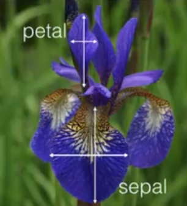
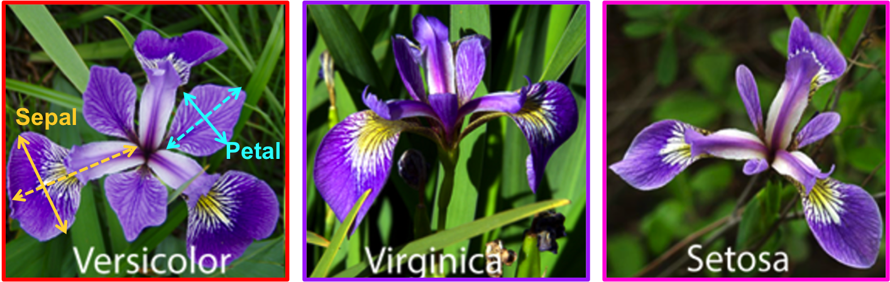
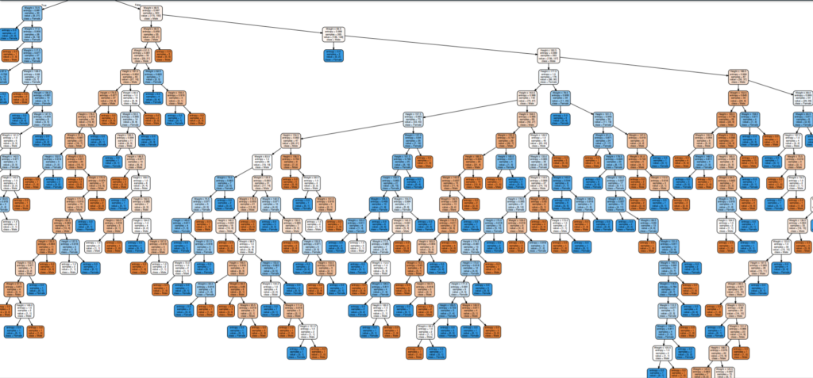
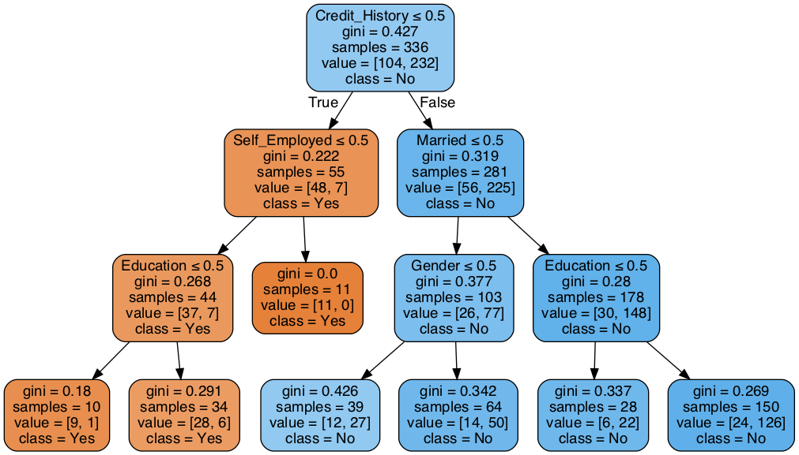
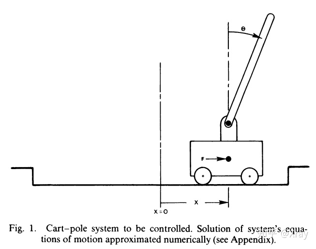
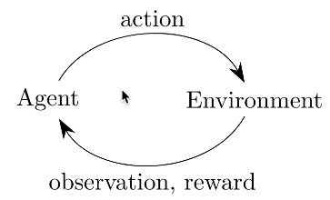
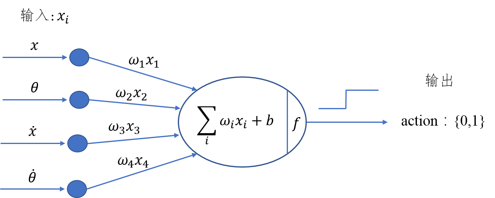
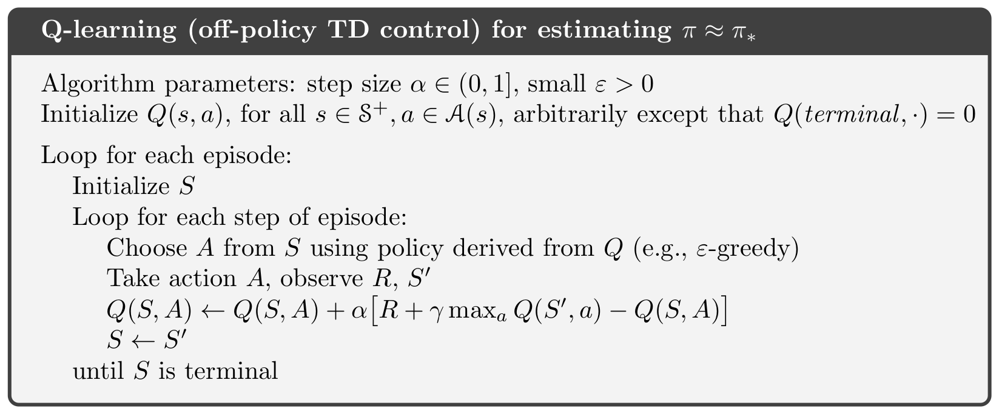
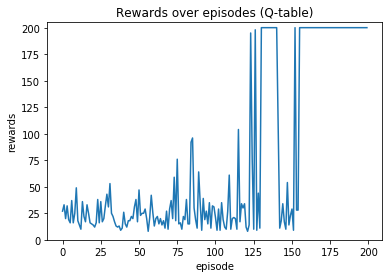

#+TITLE: AI for TNFSH: 從入門到入土
# -*- org-export-babel-evaluate: nil -*-
#+INCLUDE: ../purpleweb.org
#+OPTIONS: ^:nil
#+OPTIONS: toc:2
#+EXCLUDE_TAGS: noexport

#+latex:\newpage

* 人工智慧簡介
** Chat robot
*** ELIZA
- [[https://en.wikipedia.org/wiki/ELIZA#cite_note-turing-1][What is it]]
- [[https://web.njit.edu/~ronkowit/eliza.html][web-based version]]
*** ALICE
- [[https://en.wikipedia.org/wiki/Artificial_Linguistic_Internet_Computer_Entity][About ALICE]]
- [[http://www.mfellmann.net/content/alice.html][web-based version]]
*** Mitsuku
- [[https://en.wikipedia.org/wiki/Mitsuku][About Mitsuku]]
- [[https://chat.kuki.ai/][Try it]]
#+latex:\newpage

* 背景知識
#+latex:\newpage

* 監督式學習
** 最短距離分類器
#+begin_src python -r -n :results output :exports both
import math
#from statistics import mean

# importing reduce()
from functools import reduce

def Average(lst):
    avgx = 0
    avgy = 0
    for (x, y) in lst:
        avgx += x
        avgy += y
    return avgx/len(lst), avgy/len(lst)

def ed(lst, x, y):
    dist = 0
    for (lx, ly) in lst:
        dist += (x - lx)*(x - lx) + (y - ly)*(y - ly)
    return math.sqrt(dist)

groupA = [[4, 6] ,[5,7] ,[5,8] ,[5.8,6] ,[6,6] ,[6,7] ,[7,5] ,[7,7] ,[8,4] ,[9,5]]
groupB = [[2,2] ,[4,2] ,[4,4] ,[5,4] ,[5,3] ,[6,2]]

tarx = 5
tary = 5

centerX, centerY = Average(groupA)
sdA = (tarx - centerX)*(tarx - centerX)
centerX, centerY = Average(groupB)
sdB = (tarx - centerX)*(tarx - centerX)

if sdA < sdB:
    print("A")
else:
    print("B")

print(ed(groupA, tarx, tary))
print(ed(groupB, tarx, tary))

#+end_src

#+RESULTS:
: B
: 7.851114570556208
: 6.708203932499369

** KNN實作
K-NearestNeighbor分類算法是機器學習裡監督類學習中最簡單的方法之一,由Cover和Hart在1968年提出。kNN算法的核心思想是如果一個樣本在特徵空間中的k個最相鄰的樣本中的大多數屬於某一個類別，則該樣本也屬於這個類別，並具有這個類別上樣本的特性。

KNN為 lazy learner(惰性學習器)的典型例子，所謂惰性是指它不會從「訓練數據集」中學習出「判別函數」(discriminative function)，它的作法是把「訓練數據集」記憶起來。其步驟如下：
1) 選定 k 的值和一個「距離度量」(distance metric)。
2) 找出 k 個想要分類的、最相近的鄰近樣本。
3) 以多數決的方式指定類別標籤。

*** 鳶尾花分類問題
**** DataSet
收集了3種鳶尾花的四個特徵，分別是花萼(sepal)長寬、花瓣(petal)長寬度，以及對應的鳶尾花種類。
#+CAPTION: 鳶尾花的花萼與花瓣
#+LABEL:fig:iris-1
#+name: fig:iris-1
#+ATTR_LATEX: :width 300
#+ATTR_ORG: :width 300
#+ATTR_HTML: :width 400

**** Mission
輸入花萼和花瓣數據後，推測所屬的鳶尾花類型。
#+CAPTION: 三種鳶尾花
#+LABEL:fig:Labl
#+name: fig:Name
#+ATTR_LATEX: :width 400
#+ATTR_ORG: :width 400
#+ATTR_HTML: :width 600

*** 實作
1. 讀取資料集
   #+begin_src python -r -n :results output :exports no
from sklearn import datasets

# 讀入資料
iris = datasets.load_iris()
print(iris.DESCR)
   #+end_src

2. 取出特徵與標籤
   #+begin_src python -r -n :results output :exports no
x = iris.data
y = iris.target
print(x[:5])
print(y[:5])
   #+end_src
3. 資料觀察
   #+begin_src python -r -n :results output :exports both
import matplotlib.pyplot as plt
import pandas as pd
import seaborn as sns
#把nupmy ndarray轉為pandas dataFrame,加上columns title
npx = pd.DataFrame(x, columns=['fac1','fac2','fac3','fac4'])
npy = pd.DataFrame(y.astype(int), columns=['category'])
#合併
dataPD = pd.concat([npx, npy], axis=1)
print(dataPD)
# 畫圖
sns.lmplot('fac1', 'fac2', data=dataPD, hue='category', fit_reg=False)
plt.show()
   #+end_src

4. 分割資料集
   #+begin_src python -r -n :results output :exports both
from sklearn.model_selection import train_test_split
# 劃分資料集
x_train, x_test, y_train, y_test = train_test_split(iris.data, iris.target, random_state=6)
   #+end_src
   - train_test_split()
     所接受的變數其實非常單純，基本上為 3 項：『原始的資料』、『Seed』、『比例』
     1. 原始的資料：就如同上方的 data 一般，是我們打算切成 Training data 以及 Test data 的原始資料
     2. Seed： 亂數種子，可以固定我們切割資料的結果
     3. 比例：可以設定 train_size 或 test_size，只要設定一邊即可，範圍在 [0-1] 之間
   - scikit-learn.org: sklearn.model_selection.train_test_split
     
     Split arrays or matrices into random train and test subsets

     Quick utility that wraps input validation and next(ShuffleSplit().split(X, y)) and application to input data into a single call for splitting (and optionally subsampling) data in a oneliner.
     #+begin_src python -r -n :results output :exports both
 sklearn.model_selection.train_test_split(*arrays, test_size=None, train_size=None, random_state=None, shuffle=True, stratify=None)[source]
     #+end_src
     - [[https://scikit-learn.org/stable/modules/generated/sklearn.model_selection.train_test_split.html][online docs]]

5. 資料標準化
   #+begin_src python -r -n :results output :exports both
# 將資料標準化: 利用preprocessing模組裡的StandardScaler類別
from sklearn.preprocessing import StandardScaler
# 利用fit方法，對X_train中每個特徵值估平均數和標準差
# 然後對每個特徵值進行標準化(train和test都要做)
# 特徵工程：標準化
transfer = StandardScaler()
x_train = transfer.fit_transform(x_train)
x_test = transfer.fit_transform(x_test)
   #+end_src

6. 分類
   #+begin_src python -r -n :results output :exports both
from sklearn.neighbors import KNeighborsClassifier
# KNN 分類器
estimator = KNeighborsClassifier(n_neighbors=1)
estimator.fit(x_train, y_train)

# 模型評估
# 方法一：直接對比真實值和預測值
y_predict = estimator.predict(x_test)
print('y_predict：\n', y_predict)
print('直接對比真實值和預測值:\n', y_test == y_predict)

# 方法二：計算準確率
score = estimator.score(x_test, y_test)
print('準確率:\n', score)
  #+end_src

*** 作業
修改上述程式碼，以折線圖表示K值與KNN預測準確度間的關係。

** 決策樹實作
一棵複雜的決策樹
#+CAPTION: Caption
#+LABEL:fig:Labl
#+name: fig:Name
#+ATTR_LATEX: :width 500
#+ATTR_ORG: :width 500
#+ATTR_HTML: :width 800

*** iris
#+begin_src python -r -n :results output :exports both
from sklearn.datasets import load_iris
from sklearn import tree
from sklearn.model_selection import train_test_split

# Load in our dataset
# # 讀入鳶尾花資料
iris = load_iris()
iris_x = iris.data
iris_y = iris.target

# 切分訓練與測試資料
train_x, test_x, train_y, test_y = train_test_split(iris_x, iris_y, test_size = 0.3)

# 建立分類器
# Initialize our decision tree object
classification_tree = tree.DecisionTreeClassifier(criterion = "entropy")

# Train our decision tree (tree induction + pruning)
classification_tree = classification_tree.fit(iris_x, iris_y)

# 預測
test_y_predicted = classification_tree.predict(test_x)
print(test_y_predicted)

# 標準答案
print(test_y)

print('得分:',classification_tree.score(iris_x, iris_y))
import graphviz

import pydot
import matplotlib.pyplot as plt
plt.clf()
dot_data = tree.export_graphviz(classification_tree, out_file=None,
                     feature_names=iris.feature_names,
                     class_names=iris.target_names,
                     filled=True, rounded=True,
                     special_characters=True)
graph = graphviz.Source(dot_data)
#graph.render("images/DecisionTree.png", view=True)
graph.format = 'png'
graph.render('images/DecisionTree')
#plt.savefig('images/DecisionTree.png', dpi=300)

#+end_src

#+RESULTS:
: [0 0 0 0 1 2 0 1 0 2 2 0 2 2 2 2 2 1 1 1 0 2 1 1 2 1 2 2 0 2 0 1 0 2 0 2 2
:  0 1 1 1 2 2 0 0]
: [0 0 0 0 1 2 0 1 0 2 2 0 2 2 2 2 2 1 1 1 0 2 1 1 2 1 2 2 0 2 0 1 0 2 0 2 2
:  0 1 1 1 2 2 0 0]
: 得分: 1.0

#+CAPTION: Decision Tree
#+LABEL:fig:Labl
#+name: fig:Name
#+ATTR_LATEX: :width 500
#+ATTR_ORG: :width 500
#+ATTR_HTML: :width 800
[[file:images/DecisionTree.png]]
*** bank-loan[fn:1]
1. Load the data and finish the cleaning process

   #+begin_src python -r -n :results output :exports both
#the dataset is available on kaggle too
train = pd.read_csv('/kaggle/input/bank-loan2/madfhantr.csv')

#check for missing values
train.isnull().sum()
   #+end_src

   There are two possible ways to either fill the null values with some value or drop all the missing values(I dropped all the missing values).

   If you look at the original dataset’s shape, it is (614,13), and the new data-set after dropping the null values is (480,13).
   #+begin_src python -r -n :results output :exports both
train.dropna(inplace=True)
   #+end_src
2. Take a Look at the data-set
   We found there are many categorical values in the dataset
   Howevern, The decision tree does not support categorical data as features.

   So the optimal step to take at this point is you can use feature engineering techniques like label encoding and one hot label encoding.
   #+begin_src python -r -n :results output :exports both
# I selected few of the columns from the dataset for this tutorial
train = train[['Gender','Married','Education','Self_Employed','Credit_History','Loan_Status']]

train['Gender']=train['Gender'].replace(to_replace='Male',value='1')
train['Gender']=train['Gender'].replace(to_replace='Female',value='0')

train['Married']=train['Married'].replace(to_replace='Yes',value='1')
train['Married']=train['Married'].replace(to_replace='No',value='0')

train['Self_Employed']=train['Self_Employed'].replace(to_replace='No',value='0')
train['Self_Employed']=train['Self_Employed'].replace(to_replace='Yes',value='1')

train['Education']=train['Education'].replace(to_replace='Graduate',value='1')
train['Education']=train['Education'].replace(to_replace='Not Graduate',value='0')
   #+end_src

3. Split the data-set into train and test sets
   #+begin_src python -r -n :results output :exports both
X = train.drop(columns=['Loan_Status'])
y = train.Loan_Status

from sklearn.model_selection import train_test_split
X_train,X_test,y_train,y_test = train_test_split(X,y,test_size=0.3,random_state=42)
   #+end_src
   Why should we split the data before training a machine learning algorithm?

   Please visit [[https://medium.com/@snji.khjuria/everything-you-need-to-know-about-train-dev-test-split-what-how-and-why-6ca17ea6f35][Sanjeev’s article]] regarding training, development, test, and splitting of the data for detailed reasoning.

4. Build the model and fit the train set.
   #+begin_src python -r -n :results output :exports both
from sklearn.tree import DecisionTreeClassifier
from sklearn import tree

clf = tree.DecisionTreeClassifier(max_depth=3)
clf.fit(X_train,y_train)
   #+end_src
   Before we visualize the tree, let us do some calculations and find out the root node by using Entropy.
   - Calculation 1: Find the Entropy of the total dataset

   - Calculation 2: Now find the Entropy and gain for every column

   -
5. Visualize the Decision Tree
   #+begin_src python -r -n :results output :exports both
import graphviz
dot_data = tree.export_graphviz(clf, out_file=None,
                               feature_names=['Gender','Married','Education','Self_Employed','Credit_History'],
                               class_names=['Yes','No'],filled=True,
                                rounded=True,
                              special_characters=True)
graph = graphviz.Source(dot_data)
graph.render("Gini")
graph
   #+end_src
   Well, it’s like we got the calculations right!

   So the same procedure repeats until there is no possibility for further splitting.
6. Check the score of the model
   #+begin_src python -r -n :results output :exports both
clf.score(X_test,y_test)
#output = 0.7986111111111112
   #+end_src
   We almost got 80% percent accuracy. Which is a decent score for this type of problem statement?
**** DEMO
#+begin_src python -r -n :results output :exports both
import numpy as np
import pandas as pd
## 1. Load the data and finish the cleaning process
##    the dataset is available on kaggle too
train = pd.read_csv('./madfhantr.csv')

#check for missing values
train.isnull().sum()
#
train.dropna(inplace=True)
## 2. Take a Look at the data-set
# I selected few of the columns from the dataset for this tutorial
train = train[['Gender','Married','Education','Self_Employed','Credit_History','Loan_Status']]

train['Gender']=train['Gender'].replace(to_replace='Male',value='1')
train['Gender']=train['Gender'].replace(to_replace='Female',value='0')

train['Married']=train['Married'].replace(to_replace='Yes',value='1')
train['Married']=train['Married'].replace(to_replace='No',value='0')

train['Self_Employed']=train['Self_Employed'].replace(to_replace='No',value='0')
train['Self_Employed']=train['Self_Employed'].replace(to_replace='Yes',value='1')

train['Education']=train['Education'].replace(to_replace='Graduate',value='1')
train['Education']=train['Education'].replace(to_replace='Not Graduate',value='0')
## 3. Split the data-set into train and test sets
X = train.drop(columns=['Loan_Status'])
y = train.Loan_Status

from sklearn.model_selection import train_test_split
X_train,X_test,y_train,y_test = train_test_split(X,y,test_size=0.3,random_state=42)
## 4. Build the model and fit the train set.
from sklearn.tree import DecisionTreeClassifier
from sklearn import tree

clf = tree.DecisionTreeClassifier(max_depth=3)
clf = clf.fit(X_train,y_train)
print(clf.score(X_train, y_train))
## 5. Visualize the Decision Tree
import graphviz
dot_data = tree.export_graphviz(clf, out_file=None,
                               feature_names=['Gender','Married','Education','Self_Employed','Credit_History'],
                               class_names=['Yes','No'],filled=True,
                                rounded=True,
                              special_characters=True)
graph = graphviz.Source(dot_data)
#graph.render("Gini")
graph.format = 'png'
graph.render('images/DecisionTree2')
#graph
## 6. Check the score of the model
clf.score(X_test,y_test)
#+end_src

#+RESULTS:
: 0.8125
#+CAPTION: Bank Load 2
#+LABEL:fig:tree-2
#+name: fig:tree-2
#+ATTR_LATEX: :width 500
#+ATTR_ORG: :width 500
#+ATTR_HTML: :width 800

#+latex:\newpage

* 非監督式學習
** K-Means
[[https://alankrantas.medium.com/kmeans-%E8%83%BD%E5%BE%9E%E8%B3%87%E6%96%99%E4%B8%AD%E6%89%BE%E5%87%BA-k-%E5%80%8B%E5%88%86%E9%A1%9E%E7%9A%84%E9%9D%9E%E7%9B%A3%E7%9D%A3%E5%BC%8F%E6%A9%9F%E5%99%A8%E5%AD%B8%E7%BF%92%E6%BC%94%E7%AE%97%E6%B3%95-%E6%89%80%E4%BB%A5%E5%AE%83%E5%88%B0%E5%BA%95%E6%9C%89%E5%95%A5%E7%94%A8-%E4%BD%BF%E7%94%A8-scikit-learn-%E8%88%87-python-5dd8c0c8b167][KMeans：能從資料中找出 K 個分類的非監督式機器學習演算法 — — 所以它到底有啥用？]]
#+begin_src python -r -n :results output :exports both
sklearn.datasets.samples_generator import make_blobs
X, y_true = make_blobs(n_samples=300, centers=4, cluster_std=0.60, random_state=0)
plt.scatter(X[:, 0], X[:, 1], s=50);
plt.show()

#+end_src
#+begin_src python -r -n :results output :exports both
from sklearn.cluster import KMeans

kmeans = KMeans(n_clusters=3)

kmeans.fit(X)
cluster = kmeans.predict(X)

plt.scatter(X[:,0], X[:,1], c=cluster, cmap=plt.cm.Set1)

plt.show()
#+end_src

** Hierarchical clustering
階層式分群法（Hierarchical Clustering）
階層式分群法透過一種階層架構的方式，將資料層層反覆地進行分裂或聚合，以產生最後的樹狀結構，常見的方式有兩種：

*** 聚合式階層分群法 (Bottom-up, agglomerative) : 如果採用聚合的方式，階層式分群法可由樹狀結構的底部開始，將資料或群聚逐次合併。
定義兩個群聚之間的距離
- 單一連結聚合演算法(single-linkage agglomerative algorithm)：群聚與群聚間的距離可以定義為不同群聚中最接近兩點間的距離。
- 完整連結聚合演算法(complete-linkage agglomerative algorithm）：群聚間的距離定義為不同群聚中最遠兩點間的距離，這樣可以保證這兩個集合合併後, 任何一對的距離不會大於 d。
- 平均連結聚合演算法(average-linkage agglomerative algorithm)：群聚間的距離定義為不同群聚間各點與各點間距離總和的平均。沃德法（Ward's method）：群聚間的距離定義為在將兩群合併後，各點到合併後的群中心的距離平方和。
#+begin_src python -r -n :results output :exports both
import scipy.cluster.hierarchy as sch
dis=sch.linkage(X,metric='euclidean',method='ward')
#metric: 距離的計算方式
#method: 群與群之間的計算方式，”single”, “complete”, “average”, “weighted”, “centroid”, “median”, “ward”

sch.dendrogram(dis)
plt.title('Hierarchical Clustering')
plt.show()
#+end_src

Agglomerative Clustering Sample
#+begin_src python -r -n :results output :exports both
from sklearn.cluster import AgglomerativeClustering
import numpy as np

# randomly chosen dataset
X = np.array([[1, 2], [1, 4], [1, 0],
              [4, 2], [4, 4], [4, 0]])

# here we need to mention the number of clusters
# otherwise the result will be a single cluster
# containing all the data
clustering = AgglomerativeClustering(n_clusters = 2).fit(X)

# print the class labels
print(clustering.labels_)
#+end_src
**** 利用距離決定群數，或直接給定群數。
建構好聚落樹狀圖後，我們可以依照距離的切割來進行分類，也可以直接給定想要分類的群數，讓系統自動切割到相對應的距離。
- 距離切割
  所給出的樹狀圖，y軸代表距離，我們可以用特徵之間的距離進行分群的切割。
  #+begin_src python -r -n :results output :exports both
max_dis=5
clusters=sch.fcluster(dis,max_dis,criterion='distance')
  #+end_src
- 直接給定群數
  同時，我們也可以像sklearn一樣，直接給定我們所想要分出的群數。
  #+begin_src python -r -n :results output :exports both
k=5
clusters=sch.fcluster(dis,k,criterion='maxclust')
  #+end_src
**** 如何評估最佳分群數:K
- [[https://jimmy-huang.medium.com/kmeans%E5%88%86%E7%BE%A4%E6%BC%94%E7%AE%97%E6%B3%95-%E8%88%87-silhouette-%E8%BC%AA%E5%BB%93%E5%88%86%E6%9E%90-8be17e634589][Kmeans分群演算法 與 Silhouette 輪廓分析]]
- [[https://www.geeksforgeeks.org/implementing-agglomerative-clustering-using-sklearn/][Implementing Agglomerative Clustering using Sklearn]]
*** 分裂式階層分群法 (Top-down, divisible) : 如果採用分裂的方式，則由樹狀結構的頂端開始，將群聚逐次分裂。
Divisive clustering : Also known as top-down approach. This algorithm also does not require to prespecify the number of clusters. Top-down clustering requires a method for splitting a cluster that contains the whole data and proceeds by splitting clusters recursively until individual data have been splitted into singleton cluster.

** K-Means壓縮影像

** Hierarchical
#+latex:\newpage

* 增強式學習
:PROPERTIES:
:CUSTOM_ID: AI-RL
:END:
強化學習(Reinforcement learning, RL)是機器學習的一個子領域，在智能控制機器人及分析預測等領域有許多應用。強化學習通過與環境進行交互獲得的獎賞指導行為，目標是使智能體獲得最大的獎賞，最終開發出智能體(Agent)做出決策和控制[fn:5]。

對RL稍有了解的同學都知道，Exploration是一件很重要同時也很困難的事情。與其他機器學習範式相比，RL通常只知道某個動作的能得多少分，卻不知道該動作是不是最好的——這就是基於evaluate的強化學習與基於instruct的監督學習的根本區別。

正因如此，RL的本質決定了它極其需要Exploration，我們需要通過不斷地探索來發現更好的決策，或者至少證明當前的決策是最好的——所以Exploration-Exploitation成為了強化學習領域諸個Tradeoff中最出名的一個[fn:3]。

最簡單的exploration方法就是epsilon-greedy，即設置一個探索率epsilon來平衡兩者的關係——在大部分時間裡採用現階段最優策略，在少部分時間裡實現探索。Epsilon-greedy很簡單，它根本不會考慮更加有針對性的探索機制，它僅僅是在純貪心的基礎上加入了一定機率的uniform噪聲——所以epsilon-greedy又被稱為Naive Exploration[fn:3]。

** Open AI Gym
OpenAI Gym 是一個提供許多測試環境的工具，讓大家有一個共同的環境可以測試自己的 RL 演算法，而不用花時間去搭建自己的測試環境。
*** module
於本機執行至少會用到以下兩個python module，若要在遠端主機或colab上執行則要再做其他額外設定。
#+begin_src shell -r -n :results output :exports both
pip install --user gym
pip install --user pyglet==1.5.11 (或是1.5.14)
#+end_src

** CartPole
Gym上有許多可用工具，CartPole是其中較為簡單常見的一種，CartPole是一個桿子連在一個小車上，小車可以無摩擦的左右運動，桿子（倒立擺）一開始是豎直線向上的。小車通過左右運動使得桿子不倒。
#+CAPTION: Cart-pole system
#+LABEL:fig:Cart-pole
#+name: fig:Cart-pole
#+ATTR_LATEX: :width 300
#+ATTR_ORG: :width 300
#+ATTR_HTML: :width 400

*** 執行測試與環境變數
以下是一段最基本的測試程式
#+begin_src python -r -n :noeval
import gym
# 建立執行環境
env = gym.make('CartPole-v0')
# 將執行環境初始化
env.reset()
for _ in range(100):
    env.render()
    # 隨機籨action_space中挑選下一動作(action)丟入step執行
    env.step(env.action_space.sample())
env.close()
#+end_src
如下圖所示，增強式學習的核心就是: Agent採取Action，採取行動後，環境可能會被改變，而環境會給Agent一個Reward，讓Agent知道這Action好不好。其中：
action有0或1兩種可能值，代表將將車子向左或向右控制。
#+CAPTION: Cartpole cycle
#+LABEL:fig:Cart-cycle
#+name: fig:Cart-cycle
#+ATTR_LATEX: :width 200
#+ATTR_ORG: :width 200
#+ATTR_HTML: :width 300

就Cartpole來說，action丟入環境執行後，可以得到幾個相關的環境資訊(由step function傳回)，這些變數可由以下方式取得
#+begin_src python -r -n :results output :exports both
import gym
# 建立執行環境
env = gym.make('CartPole-v0')
# 將執行環境清空為預設值(從新開始)
env.reset()
rewards = 0
for _ in range(100):
    env.render()
    # 仍然隨機產生 action
    action = env.action_space.sample()
    # actionh去入環境執行，傳回環境資訊
    observation, reward, done, info = env.step(action)
    # 輸出來查看一下
    rewards += reward
    print(observation)
    if done: # 回合結束，可能柱子太傾斜或車子跑遠
        # 若達到結束條件，就離開for loop
        print("Rewards: ", rewards)
        break
env.close()
#+end_src

#+RESULTS:
#+begin_example
[-0.00943879  0.18031594 -0.0417659  -0.35468228]
[-0.00583247  0.37600609 -0.04885955 -0.66023713]
[ 0.00168765  0.57177271 -0.06206429 -0.96789561]
[ 0.01312311  0.76767064 -0.0814222  -1.27941193]
[ 0.02847652  0.57367526 -0.10701044 -1.01329459]
[ 0.03995002  0.38013086 -0.12727633 -0.75603972]
[ 0.04755264  0.18697153 -0.14239713 -0.50596262]
[ 0.05129207  0.38378269 -0.15251638 -0.83991479]
[ 0.05896772  0.58062118 -0.16931468 -1.17641133]
[ 0.07058015  0.77748867 -0.1928429  -1.51703092]
[ 0.08612992  0.58515093 -0.22318352 -1.29021731]
Rewards:  11.0
#+end_example
如執行結果所示，雖然我們在程式中指定跑100次動作，但是更可能的是因為隨機動作而提前結束，而每一次的執行都會帶來不同的環境變數內容。
*** 重要環境變數
在 Gym 的仿真環境中，有運動空間 action_space 和觀測空間observation_space 兩個指標，程序中被定義爲 Space類型，用於描述有效的運動和觀測的格式和範圍。我們可以利用以下程式碼大致觀察一下這兩個Space:
#+begin_src python -r -n :results output :exports both
import gym
env = gym.make('CartPole-v0')
print(env.action_space)
print(env.observation_space)
#+end_src

#+RESULTS:
: Discrete(2)
: Box(-3.4028234663852886e+38, 3.4028234663852886e+38, (4,), float32)
由結果可以看出:
- action_space 是一個離散Discrete類型，從discrete.py源碼可知，範圍是一個{0,1,…,n-1} 長度爲 n 的非負整數集合，在CartPole-v0例子中，動作空間表示爲{0,1}。
- observation_space 是一個Box類型，從box.py源碼可知，表示一個 n 維的盒子，所以在上一節打印出來的observation是一個長度爲 4 的數組。數組中的每個元素都具有上下界。
**** Observation:
Type: Box(4)[fn:4]
| Num | Observation           |                  Min |                Max |
|-----+-----------------------+----------------------+--------------------|
|   0 | Cart Position         |                 -4.8 |                4.8 |
|   1 | Cart Velocity         |                 -Inf |                Inf |
|   2 | Pole Angle            | -0.418 rad (-24 deg) | 0.418 rad (24 deg) |
|   3 | Pole Angular Velocity |                 -Inf |                Inf |
**** Actions: 動作空間是離散空間
Type: Discrete(2)
| Num | Action                 |
|-----+------------------------|
|   0 | Push cart to the left  |
|   1 | Push cart to the right |
註：施加的力大小是固定的，但減小或增大的速度不是固定的，它取決於當時桿子與豎直方向的角度。角度不同，產生的速度和位移也不同。
**** Reward
Reward is 1 for every step taken, including the termination step. The threshold is 475 for v1.
每一步都給出1的獎勵，包括終止狀態。
**** 初始狀態:
初始狀態所有觀測值都從[-0.05, 0.05]中隨機取值。
**** 達到下列條件之一即結束一回合(片段):
1. 桿子與豎直方向角度超過12度
2. 小車位置距離中心超過2.4（小車中心超出畫面）
3. 片段長度超過200連續100次
4. 嘗試的平均獎勵大於等於195。
*** 分組作業:
上述程式只執行了一回合的模擬，請你修改上述程式，進行200回合的模擬，記錄每回合隨機運作的reward結果，並將結果畫成折線圖，x軸為回合數；y軸為每回合的reward，

** 直覺反應的CartPole
前節程式以隨機方式來左右擺動車子，這很顯然不符合真實情境，再笨的人也會隨杆子的擺動來控制車子，例如：當杆子快往左傾，就把車子往左移，以下就是這種實作的程式碼：
#+begin_src python -r -n :results output :exports both
import gym

# 建立環境, 定義訓練的遊戲
env = gym.make('CartPole-v0')

observation = env.reset() # 把柱子擺好
rewards = 0
for t in range(200):
    #env.render()
    #取得目前狀態
    pos, v, ang, rot = observation
    # 進行自己設計的Action
    if ang < 0:
        action = 0 ##車往左移
    else:
        action = 1 ## 車往右移
        # 在環境中做出 action
    observation, reward, done, info = env.step(action)
    # 累加 reward
    rewards += reward
    if done: # 回合結束，可能柱子太傾斜或車子跑遠
        print('Rewards: ', rewards)
        break

env.close()
#+end_src
因為沒有在學習，趨勢肯定是平的。不過平均每回合的總 reward 明顯比隨機來得好，大概能撐兩倍時間。

#+RESULTS:
: Rewards:  51.0
*** 分組作業
上述程式只是簡單的依杆子角度來移動車子，你能否再想出更好的策略(即可以在結束前得到更多reward，最多到200)?請觀察observation的內容，傾全組之力想出最佳策略並實作出來，進行200次模擬，畫出模擬的rewards折線統計圖。

** Hill Climbing Strategy [fn:5] 
爲了能夠有效控制倒立擺首先應建立一個控制模型。明顯的，這個控制模型的輸入應該是當前倒立擺的狀態（observation）而輸出爲對當前狀態做出的決策動作（action）。從前面的知識我們瞭解到決定倒立擺狀態的observation是一個四維向量，包含小車位置（\(x\)）、杆子夾角（\(\theta\)）、小車速度（\(\dot{x}\)）及角變化率（\(\dot{\theta}\)），如果對這個向量求它的加權和，那麼就可以根據加權和值的符號來決定採取的動作（action），用sigmoid函數將這個問題轉化爲二分類問題，從而可以建立一個簡單的控制模型。其模型如下圖所示：
#+CAPTION: Hill Climbing Moddel
#+LABEL:fig:HCModel
#+name: fig:HCModel
#+ATTR_LATEX: :width 300
#+ATTR_ORG: :width 500
#+ATTR_HTML: :width 500

上圖的實際功能與神經網絡有幾分相似，但比神經網絡要簡單得多。通過加入四個權值，我們可以通過改變權重值來改變決策（policy），即有加權和$$H_{sum} = w_1x+w_2\theta + w_3\dot{x} + w_4\dot\theta + b$$，若\(H_{sum}\)的符號爲正判定輸出爲1，否則爲0。

爬山算法的基本思路是每次迭代時給當前取得的最優權重加上一組隨機值，如果加上這組值使得有效控制倒立擺的持續時間變長了那麼就更新它爲最優權重，如果沒有得到改善就保持原來的值不變，直到迭代結束。在迭代過程中，模型的參數不斷得到優化，最終得到一組最優的權值作爲控制模型的解。
*** 其代碼如下:
#+begin_src python -r -n :results output :exports both
import numpy as np
import gym

def get_sum_reward_by_weights(env, weights):
    #測試不同權重的model所得到的奬勵
    observation = env.reset() #重置狀態
    rewards = 0
    for t in range(1000):
        env.render()
        # 依目前權值針對當前狀態來選action
        # 原來的做法為: action = env.action_space.sample()
        action = 1 if np.dot(weights[:4], observation) + weights[4] >= 0 else 0
        # 執行action, 取得下一步狀態
        observation, reward, done, info = env.step(action)
        rewards += reward
        if done:
            print(t)
            break
    return rewards

def get_best_result():
    np.random.seed(10)
    best_reward = 0 # 初始最佳奬勵
    best_weights = np.random.rand(5) # 初始權值為隨機值

    for iter in range(1000): #迭代100次
        cur_weights = None
        print("iteration:",iter)
        cur_weights = best_weights + np.random.normal(0, 0.1, 5) #在當前最佳權值加入隨機值
        # cur_weights = np.random.rand(5) #隨機猜測
        cur_sum_reward = get_sum_reward_by_weights(env, cur_weights)
        reward_rec.append(cur_sum_reward) #記錄用
        if cur_sum_reward > best_reward:
            best_reward = cur_sum_reward
            best_weights = cur_weights
        if best_reward >= 200:
            print(iter,":",best_reward)
            print("best_weight",best_weights)
            break;

env = gym.make("CartPole-v0")
reward_rec = []

print(get_best_result())
# 輸出統計
import matplotlib.pyplot as plt
plt.clf()
x = range(1, len(reward_rec)+1)
plt.plot(x, reward_rec)
env.close()

#+end_src
爬山算法本質是一種局部擇優的方法，效率高但因爲不是全局搜索，所以結果可能不是最優。

** Q-Learning
QLearning是強化學習算法中value-based的算法，Q即為Q（s,a）就是在某一時刻的 s 狀態下(s∈S)，採取 動作a (a∈A)動作能夠獲得收益的期望，環境會根據agent的動作反饋相應的回報reward r，所以算法的主要思想就是將State與Action構建成一張Q-table來存儲Q值，然後根據Q值來選取能夠獲得最大的收益的動作[fn:6]。

一個 Q-learning 非常簡單的實現法複是用一個 model 來 approximate Q-value function，並藉由下面的 update rule 來訓練這個 model：
$$Q(S_t, a_t) = Q(s_t, a_t) + \alpha(R_{t+1} + \gamma\max_aQ(s_{s_t+1},a)-Q(s_t,a_t))$$
Q-table 是用 lookup table 來 approximate Q-value function，並用 Q-learning 訓練的一個方法。這個 lookup table 會將每個 state-action pair (s, a) 對應到 approximation Q(s, a)，一開始 table 裡的 Q-value 隨機設置，並在訓練過程中更新這些 Q-value。所以我們其實沒有在訓練一個 model 更新參數讓預測數值更接近 Q-value，而是直接用一個 table 記錄這些值並更新。

另外我們的 state 是連續值，這樣會有無限多個可能的 state-action pair，因此我們要 discretize 這些值才能建立一個 lookup table。

例如實作中我們把 state 的 4 個 feature (position, velocity, angle, rotation rate) 分別 discretize 成 (1, 1, 6, 3) 個 bucket，6 個 bucket 就代表 angle 的範圍 [-0.5, 0.5] 被切成 6 個區間，區間中的值都對應到相同的 discrete value。
*** Algorithms
#+CAPTION: Q-Learning Algorithm
#+LABEL:fig:Labl
#+name: fig:Name
#+ATTR_LATEX: :width 500
#+ATTR_ORG: :width 600
#+ATTR_HTML: :width 500

在更新 Q table 時，計算 reward 不只包含採取 action \(a\)獲得的 reward \(r\)r，還包含 \(\gamma max_{a^{'}}Q(s^{'},q^{'})\)。這個概念是，agent 不僅僅看當下採取的行動帶來的好處，他也會估計到達下一個 state \(s^{'}\) 後，最多可以有多少好處（因為在\(s^{'}\)也可以採取各種 action）。
換句話說，這個 agent 不是一個目光如豆的 agent，他會考慮未來。因為加上了\(\gamma max_{a^{'}}Q(s^{'},q^{'})\)(當然\(\gamma\)不能是 0)，讓我們的 agent 從 會立刻吃掉棉花糖的小朋友，進化成可以晚一點再吃多一點棉花糖的小朋友，是不是很有趣呢！
*** Q-Table
一個 Q-learning 非常簡單的實現法。複習一下我們在前篇提到 Q-learning，是用一個 model 來 approximate Q-value function，並藉由下面的 update rule 來訓練這個 model：
$$ Q(s_t,a_t) = Q(s_t,a_t) + \alpha(R_{t+1}) + \gamma \max_{a} Q(s_{t+1}, - Q(s_t,a_t)) $$
Q-table 是用 lookup table 來 approximate Q-value function，並用 Q-learning 訓練的一個方法。這個 lookup table 會將每個 state-action pair (s, a) 對應到 approximation Q(s, a)，一開始 table 裡的 Q-value 隨機設置，並在訓練過程中更新這些 Q-value。所以我們其實沒有在訓練一個 model 更新參數讓預測數值更接近 Q-value，而是直接用一個 table 記錄這些值並更新。

另外我們的 state 是連續值，這樣會有無限多個可能的 state-action pair，因此我們要 discretize 這些值才能建立一個 lookup table。

例如實作中我們把 state 的 4 個 feature (position, velocity, angle, rotation rate) 分別 discretize 成 (1, 1, 6, 3) 個 bucket，6 個 bucket 就代表 angle 的範圍 [-0.5, 0.5] 被切成 6 個區間，區間中的值都對應到相同的 discrete value。

1. 整個 discretization 大概是這樣：
   #+begin_src python -r -n :results output :exports both
# state bucket 設定
n_buckets = (1, 1, 6, 3)

# action 已經是 discrete value
n_actions = env.action_space.n

# 建立 Q-table
q_table = np.zeros(n_buckets + (n_actions,))

# 設定好每個 state feature 的上下界
state_bounds = list(zip(env.observation_space.low, env.observation_space.high))
state_bounds[1] = [-0.5, 0.5]
state_bounds[3] = [-math.radians(50), math.radians(50)]

# 將 env 給的 state 轉換成 discretized state
def get_state(observation, n_buckets, state_bounds):
    state = [0] * len(observation)
    for i, s in enumerate(observation):
        # 每個 feature 上界、下界
        l, u = state_bounds[i][0], state_bounds[i][1]
        if s <= l: # 低於下界屬於第 1 個 bucket
            state[i] = 0
        elif s >= u: # 高於下界屬於最後一個 bucket
            state[i] = n_buckets[i] - 1
        else: # 其他看你在哪個區間，決定你在哪個 bucket
            state[i] = int(((s - l) / (u - l)) * n_buckets[i])
    return tuple(state)
#+end_src
state_bounds初始內容為
#+begin_src python -r -n :results output :exports both
[(-4.8, 4.8),
 [-0.5, 0.5],
 (-0.41887903, 0.41887903),
 [-0.8726646259971648, 0.8726646259971648]]
#+end_src
q_table為(1, 1, 6, 3, 2)的ndarray，初始內容為
#+begin_src python -r -n :results output :exports both

array([[[[[0., 0.],
          [0., 0.],
          [0., 0.]],

         [[0., 0.],
          [0., 0.],
          [0., 0.]],

         [[0., 0.],
          [0., 0.],
          [0., 0.]],

         [[0., 0.],
          [0., 0.],
          [0., 0.]],

         [[0., 0.],
          [0., 0.],
          [0., 0.]],

         [[0., 0.],
          [0., 0.],
          [0., 0.]]]]])
#+end_src
2. 再來是\(\epsilon-greedy\)的使用，選擇 action 時，有\(\epsilon\)的機率隨機選擇以增加 exploration，其他時間照著現有 policy 選擇：
   #+begin_src python -r -n :results output :exports both
def choose_action(state, q_table, action_space, epsilon):
    if np.random.random_sample() < epsilon: # 隨機
        return action_space.sample()
    else: # 根據 Q-table 選擇最大 Q-value 的 action
        return np.argmax(q_table[state])
   #+end_src
3. 最後就是做出 action 收集到 observation 和 reward 後，就可以 update Q-table：
   #+begin_src python -r -n :results output :exports both
# 算出下個 state
next_state = get_state(observation, n_buckets, state_bounds)

# Q-learning
q_next_max = np.amax(q_table[next_state])
q_table[state + (action,)] += lr * (reward + gamma * q_next_max - q_table[state + (action,)])

# Transition 到下個 state
state = next_state
   #+end_src
4. 剩下就跟前面的框架差不多了。實作中，還另外加了一些方法讓訓練成果更好，例如因為訓練後期有比較好的 policy，讓 https://chart.googleapis.com/chart?cht=tx&chl=%5Cepsilon 隨著訓練降低以減少 exploration，以及讓 learning rate 降低使訓練能收斂。
   #+begin_src python -r -n :results output :exports both
get_epsilon = lambda i: max(0.01, min(1, 1.0 - math.log10((i+1)/25)))
get_lr = lambda i: max(0.01, min(0.5, 1.0 - math.log10((i+1)/25)))

# 每回合更新 epsilon 和 lr
epsilon = get_epsilon(i_episode)
lr = get_lr(i_episode)
   #+end_src
5. 成果
   #+CAPTION: Q-Learning Performance
#+LABEL:fig:Q-Learn-Perf
#+name: fig:Q-Learn-Perf
#+ATTR_LATEX: :width 300
#+ATTR_ORG: :width 300
#+ATTR_HTML: :width 500

** 增強式學習有多強[fn:7]
我們可以使用強化學習來訓練圍棋機器人，知名的Alpha Go 就是基於強化學習來打敗人類的!
又或者學習如何玩超級馬力歐，透過一次又一次的死亡，Agent會慢慢地學習什麼時間點該跳躍閃避怪物，或者殺掉怪物。

那麼強化學習無敵了嗎?當然不是的，強化學習需要大量的訓練，如果要在電玩遊戲中贏過人類，需要的禎數可能要很高，且例如射擊遊戲需要超高的反應速度，目前的強化學習可能還無法應付。
又或者自動駕駛，假設車子已經能完美的沿著路線前進了，且能應對紅綠燈等狀況，但如果因為某些原因，影像辨識誤把紅燈當成了綠燈，這樣可能會導致嚴重的事故。

強化學習是很有趣的，但可能不是這麼萬用，但在一些領域中，可以達到超過人類水準的表現!

* 深度學習
#+latex:\newpage

* Hello world
#+latex:\newpage

* Footnotes

[fn:7] [[https://ithelp.ithome.com.tw/articles/10234272][Day 6 強化學習就是一直學習? ]]

[fn:6] [[https://blog.csdn.net/qq_30615903/article/details/80739243][【強化學習】Q-Learning算法詳解]]

[fn:5] [[https://blog.csdn.net/qq_32892383/article/details/89576003][OpenAI Gym 經典控制環境介紹——CartPole（倒立擺）]]

[fn:4] [[https://github.com/openai/gym/blob/master/gym/envs/classic_control/cartpole.py][GitHub: openai/gym ]]

[fn:3] [[https://kknews.cc/zh-tw/news/34mob53.html][強化學習Exploration漫遊]]

[fn:2] [[http://gym.openai.com/docs/][Getting Started with Gym]]

[fn:1] [[https://towardsai.net/p/programming/decision-trees-explained-with-a-practical-example-fe47872d3b53][Decision Trees Explained With a Practical Example]]
